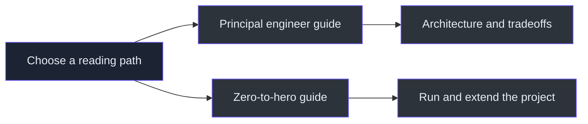
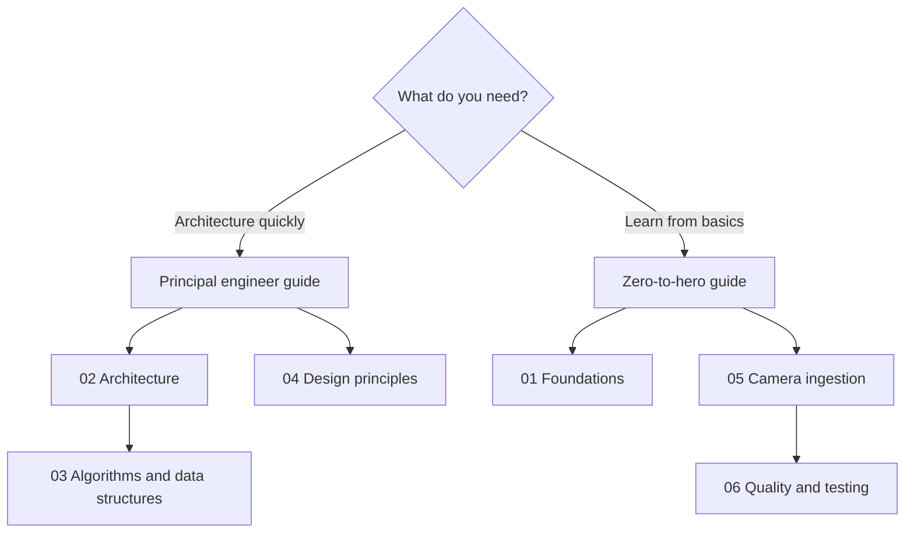

# 00 · Onboarding

> **TL;DR** — Choose the principal guide when you want architecture and tradeoffs quickly. Choose
> zero-to-hero when you want to learn the stack from first principles and run the project yourself.

## Reading choices

| Reader | Start here | Outcome |
|---|---|---|
| Principal/staff engineer | [Principal engineer guide](principal-engineer-guide.md) | Understand the core insight, boundaries, risks, and roadmap |
| New Python/OpenCV developer | [Zero-to-hero guide](zero-to-hero-guide.md) | Build the mental model progressively and run the camera |
| Interview preparation | Principal guide → algorithms → principles | Explain why the system is shaped this way |
| Contributor | Zero-to-hero → testing → repository map | Find code and make a safe change |

## Source anchors

- Packaging and supported Python: `pyproject.toml:5-13`
- CLI entry point: `pyproject.toml:25-26`
- Camera models: `src/kardboard_vtuber/camera/models.py:15-157`
- Capture worker: `src/kardboard_vtuber/camera/stream.py:39-288`
- CLI loop: `src/kardboard_vtuber/cli.py:54-126`
- Tests: `tests/test_camera_models.py:6-34`, `tests/test_camera_stream.py:13-98`

---

🏠 [Book home](../README.md) · ➡️ [Foundations](../01-foundations/README.md)
