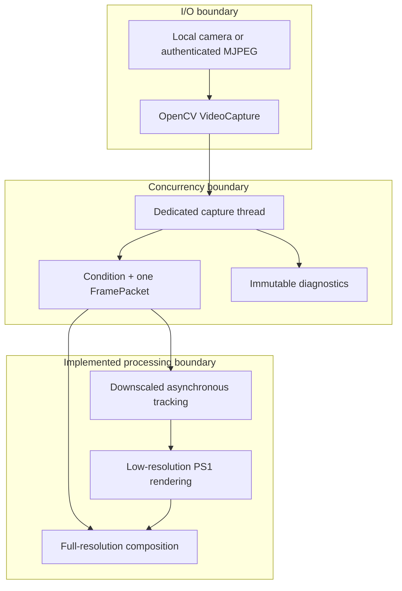
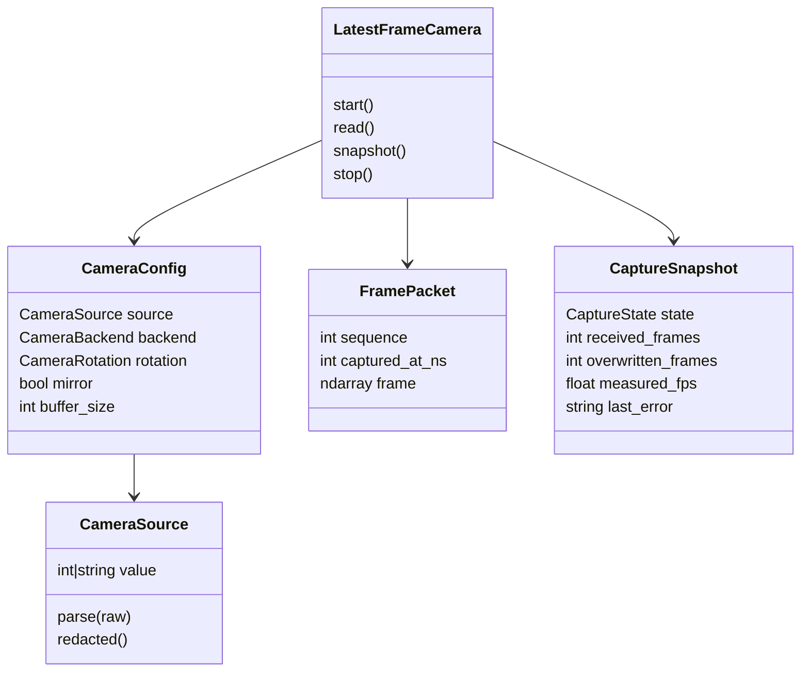

# Principal engineer guide

> **TL;DR** — The core architectural insight is that **video frames are expiring state, not durable
> work items**. The system must discard stale frames instead of faithfully processing them later.
> That one decision drives the single-slot buffer, asynchronous tracking plan, monotonic timing,
> immutable snapshots, and separation between full-resolution composition and downscaled inference.

## The one idea to remember

A normal job queue values completeness:

```javascript
while (queue.length > 0) {
  process(queue.shift()); // every item matters
}
```

A live-avatar pipeline values freshness:

```javascript
latestFrame = incomingFrame; // replace stale work
if (trackerIsReady) {
  tracker.process(latestFrame);
}
```

If a tracker can process 20 FPS while the camera produces 30 FPS, a FIFO queue adds ten frames of
delay every second. A latest-value register drops work but keeps the avatar near real time.

## Architecture at principal level



Implemented code anchors:

- The worker and shared state live in `LatestFrameCamera`
  (`src/kardboard_vtuber/camera/stream.py:39-288`).
- The single published value is `_latest: FramePacket | None`
  (`src/kardboard_vtuber/camera/stream.py:59`).
- Consumers ask for a sequence newer than the last one they processed
  (`src/kardboard_vtuber/camera/stream.py:114-141`).
- Runtime state is returned as an immutable `CaptureSnapshot`
  (`src/kardboard_vtuber/camera/models.py:141-157`).

## Domain model



## Strategic tradeoffs

| Decision | Benefit | Cost | Why acceptable |
|---|---|---|---|
| Python prototype | Fast iteration, readable algorithms | Packaging and GIL concerns | OpenCV releases into native code; current bottleneck is not Python syntax |
| OpenCV capture | One API for device and URL sources | Backend behavior varies | Backend is explicit and measured |
| Single latest frame | Bounded latency and memory | Deliberate frame loss | Live interaction values current state |
| Separate tracking resolution | High-quality final video with cheap inference | Two frame representations | Tracking does not need every camera pixel |
| One fixed avatar | Smaller architecture and faster learning | Not a general VTuber platform | Matches the actual product requirement |
| Window Capture first | Simple OBS integration | No alpha-only GPU sharing | Spout2 can be added after the renderer exists |

## Risks to watch

1. **End-to-end latency confusion.** `frame age` starts after OpenCV returns a decoded frame; it does
   not measure phone exposure, encoding, network, or decoder buffering.
2. **Python version split.** Core camera/render code supports Python 3.11+, while the implemented
   MediaPipe tracking extra is constrained below Python 3.13 in `pyproject.toml:21-23`.
3. **Credential handling.** Authenticated URLs are convenient but can leak into shell history.
   Diagnostics redact them through `CameraSource.redacted()` at
   `src/kardboard_vtuber/camera/models.py:80-87`.
4. **Renderer scope discipline.** A single cardboard head does not justify a general scene engine
   or rigid-body simulation; five bounded decorative hinges are sufficient.

## Where to go deep

1. [System architecture](../02-architecture/system-architecture.md)
2. [Latest-frame slot](../03-algorithms-and-data-structures/latest-frame-slot.md)
3. [Finite-state lifecycle](../03-algorithms-and-data-structures/finite-state-lifecycle.md)
4. [Latency over completeness](../04-design-principles/latency-over-completeness.md)
5. [Roadmap](../08-roadmap/README.md)

---

⬅️ [Onboarding](README.md) · 🏠 [Book home](../README.md)
