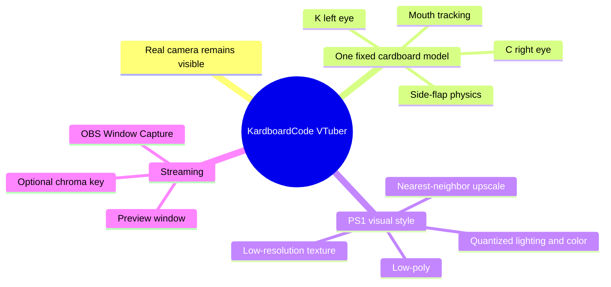
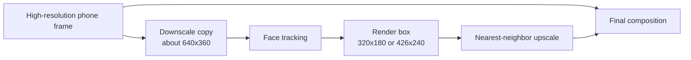

# 01 · Foundations

> **TL;DR** — KardboardCode-VTuber is not a generic avatar engine. It is a focused application that
> keeps a high-quality real camera feed and replaces only the user's head with one expressive,
> low-poly cardboard box.

## Product statement

The application:

1. Read a local or Android-phone camera.
2. Track one face and head pose.
3. Map left/right eye state to the `K` and `C` markings.
4. Tracks mouth openness for expression events and future mouth-art refinement.
5. Adds opt-in spring-driven motion to five physical flaps.
6. Render the box at low internal resolution for a PS1 aesthetic.
7. Composite it over the original high-resolution camera.
8. Present an OBS-capturable output.

  

<em>
Figure 1 — The preserved source avatar and its independent talking/blinking state combinations.
See the <a href="./visual-identity-and-source-avatar.md">visual identity chapter</a> for the full
image-guided explanation.
</em>

## Scope boundaries

| In scope | Out of scope for the prototype |
|---|---|
| One face | Multi-person tracking |
| One cardboard-head model | General model import |
| Real camera body or optional synthetic body | General character/model import |
| Python source-run workflow | Unity-first distribution |
| Window Capture for OBS | Custom OBS plugin |
| Relative head pose | Metric depth reconstruction |

## Why preserve two resolutions?

The camera image and the avatar have different jobs:

Tracking needs stable landmarks, not 2 million pixels. The final stream benefits from the full
camera resolution. The box is intentionally coarse because visual imperfection is part of the art
direction.

## Current truth versus future design

**Implemented:** camera ingestion and reconnection, credential-safe diagnostics, asynchronous
MediaPipe face/pose/hand/person tracking, One Euro filtering, calibrated expression events,
ModernGL textured rendering, five spring hinges, procedural fallback rendering, full-resolution
composition, optional full-body output, bounded hand/forearm occlusion, fail-closed green-screen
composition, and OBS Window Capture output.

**Opt-in diagnostics:** `--tracking-debug` draws synthetic tracking evidence and performance text.
`--debug-face-preview` is a separate privacy-sensitive raw camera panel.

**Remaining production work:** long-duration soak testing, CI/documentation validation, packaging,
and optional transport beyond Window Capture.

## Source anchors

- Project metadata and dependencies: `pyproject.toml:5-28`
- Preserved avatar behavior: `assets/PNGTuberV1/model-manifest.json:1`
- Working camera package: `src/kardboard_vtuber/camera/`
- Runtime orchestration: `src/kardboard_vtuber/cli.py:32-652`
- Default avatar: `src/kardboard_vtuber/renderer/textured_3d.py:111-1414`
- Green-screen path: `src/kardboard_vtuber/tracking/green_screen.py:16-152`

## Related foundation chapters

- [Product requirements and constraints](product-requirements.md)
- [Visual identity and source avatar](visual-identity-and-source-avatar.md)

---

⬅️ [Book home](../README.md) · ➡️ [Architecture](../02-architecture/README.md)
