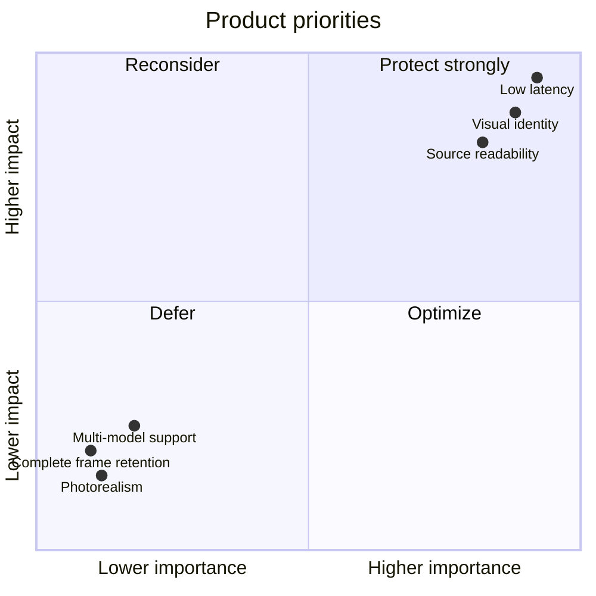
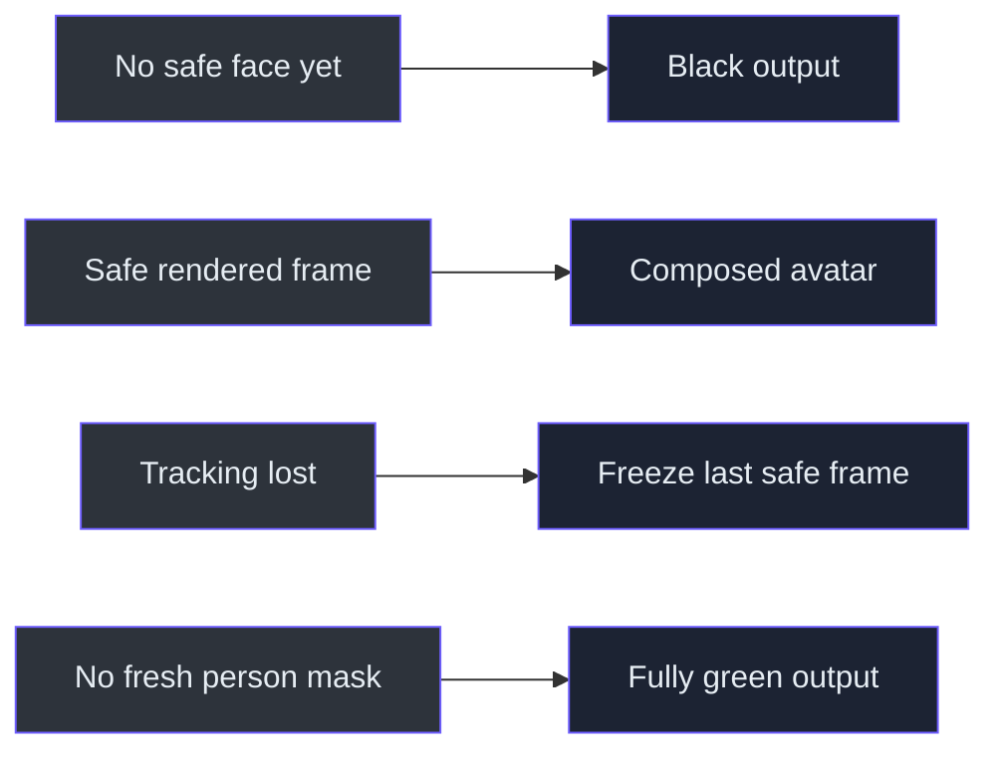

# Product requirements and constraints

> **TL;DR** — The product is optimized for one creator, one recognizable cardboard character, low
> latency, and explainable source code. Generality is intentionally deferred.

## Functional requirements

| ID | Requirement | Current state |
|---|---|---|
| FR-01 | Accept local camera indices | Implemented |
| FR-02 | Accept authenticated MJPEG/RTSP URLs | Implemented |
| FR-03 | Rotate and mirror frames | Implemented |
| FR-04 | Reconnect after repeated failures | Implemented |
| FR-05 | Track one face | Implemented |
| FR-06 | Animate `K` and `C` independently | Implemented |
| FR-07 | Track mouth state without exposing the real mouth | Implemented; flap redesign deferred |
| FR-08 | Render PS1-style cardboard geometry | Implemented in ModernGL plus procedural fallback |
| FR-09 | Produce an OBS-capturable preview | Implemented through Window Capture |
| FR-10 | Add secondary flap motion | Implemented behind `--physics` |
| FR-11 | Preserve the body while replacing the room with chroma green | Implemented behind `--green-screen` |
| FR-12 | Hide tracking diagnostics by default | Implemented behind `--tracking-debug` |

## Non-functional requirements

- **Latency:** prefer dropping old frames over showing delayed motion.
- **Performance:** target stable 1080p30 first; 60 FPS is optional.
- **Explainability:** algorithms and tradeoffs must be teachable in an interview.
- **Security:** no credentials in source, docs, diagnostics, or commits.
- **Portability:** isolate OpenCV backend differences behind configuration.
- **Art direction:** intentional low fidelity, not accidental poor rendering.

## Verified camera acceptance result

The user confirmed the real preview with:

- 1080x1920 portrait output after left rotation.
- Approximately 27.9 FPS at the observed moment.
- Mirrored selfie orientation.
- No observed read failures or reconnects during the validation run.

The overlay's 0.4 ms frame age measured only post-decode in-process delay. It was not an
end-to-end phone latency measurement.

## Implemented privacy constraints

The textured renderer blacks output before first acquisition and freezes the last safely composed
frame after face loss. Green-screen composition independently fails closed to a fully green frame
before a fresh person mask exists (`src/kardboard_vtuber/renderer/textured_3d.py:180-279`,
`src/kardboard_vtuber/tracking/green_screen.py:124-152`).

## Sources

- CLI arguments: `src/kardboard_vtuber/cli.py:32-213`
- Capture behavior: `src/kardboard_vtuber/camera/stream.py:167-220`
- Credential redaction: `src/kardboard_vtuber/camera/models.py:80-87`
- Avatar semantics: `assets/PNGTuberV1/model-manifest.json:1`
- Textured renderer: `src/kardboard_vtuber/renderer/textured_3d.py:111-1414`
- Runtime tests: `tests/test_cli.py:1`, `tests/test_textured_3d_renderer.py:1`

---

⬅️ [Foundations](README.md) · ➡️ [System architecture](../02-architecture/system-architecture.md)
