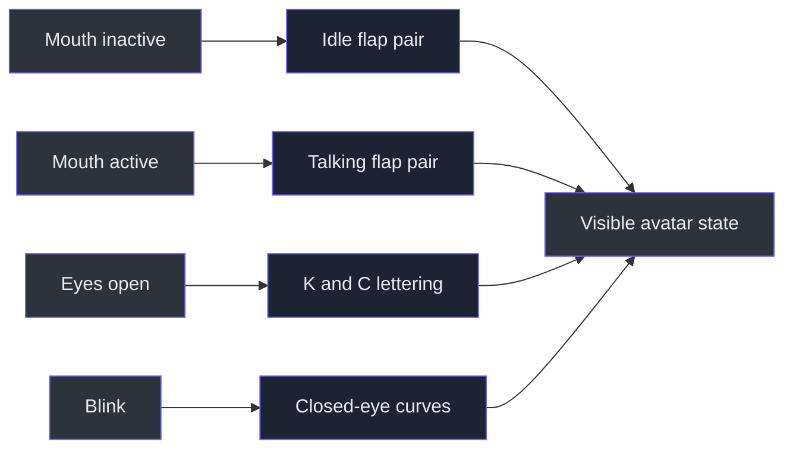
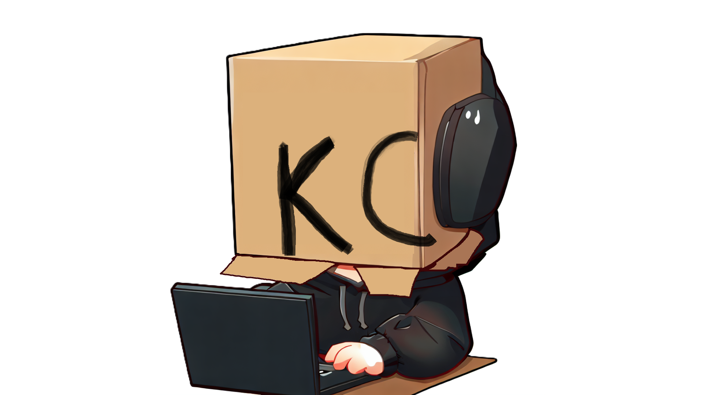
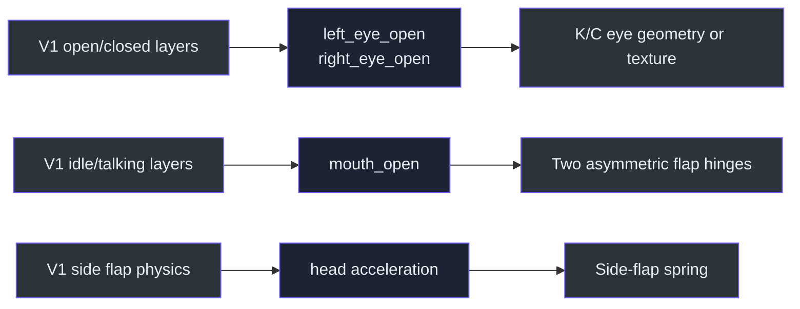

# Visual identity and source avatar

> **TL;DR** — The future 3D cardboard head is not being invented without reference. Its identity,
> eye semantics, speaking behavior, asymmetry, and secondary motion come from the preserved
> PNGTuber V1 package under `assets/PNGTuberV1`.

## Why the source avatar matters

The camera-tracked application changes the rendering technology, not the character identity. The
V1 package establishes the permanent silhouette (`assets/PNGTuberV1/Full Body.png`), independent
eye states (`assets/PNGTuberV1/Eyes Open.png`, `assets/PNGTuberV1/Eyes Closed.png`), independent
speaking states (`assets/PNGTuberV1/FrontFlap1.png`,
`assets/PNGTuberV1/FrontFlap2.png`), and secondary side-flap motion
(`assets/PNGTuberV1/RightFlap1.png`). Exact layer roles and parameters are preserved in
`assets/PNGTuberV1/model-manifest.json:1`.

  

<em>
Figure 1 — The four valid V1 combinations. Horizontal movement changes idle/talking flaps;
vertical movement changes open/blinking eyes.
</em>

## State architecture

The two state axes are independent; the manifest lists all four combinations
(`assets/PNGTuberV1/model-manifest.json:116-149`). The renderer must preserve that independence so
the user can blink while talking.

## Permanent silhouette

  

<em>
Figure 2 — The permanent V1 base. The recognizable design combines the cardboard head,
right-side headphones, dark hoodie, hands, laptop, and seated pose.
</em>

The new application initially replaces only the head in the real camera feed, so the full seated
body is reference material rather than geometry that must be reproduced immediately. The canonical
asset guide explicitly distinguishes permanent body artwork from expression layers
(`assets/PNGTuberV1/README.md:1`).

## Eye identity: K and C

  

<em>
Figure 3 — The letters are not a logo placed near the eyes; they are the open-eye expression
itself. Future tracking maps the user's left eye to K and right eye to C.
</em>

  

<em>
Figure 4 — Closed-eye curves replace both letters during the original binary blink state. The
future renderer will support independent left/right values while preserving this visual language.
</em>

## Mouth and flap identity

  

<em>
Figure 5 — Talking does not draw a conventional mouth. The front cardboard flaps change shape and
motion, making the box itself speak.
</em>

The two talking flaps intentionally use unequal amplitudes in the original model
(`assets/PNGTuberV1/model-manifest.json:71-111`). The 3D version should therefore avoid perfectly
mirrored hinge motion.

## Mapping V1 semantics to the planned model

## Implementation guardrails

1. Preserve the cardboard-box silhouette and handmade lettering.
2. Keep K and C independently controllable.
3. Drive front flaps from mouth openness, not audio volume.
4. Keep left/right flap gains asymmetric.
5. Preserve a separately sprung side flap.
6. Treat generated composites as references, not runtime source layers.
7. Keep V1 files unchanged as historical canonical input.

## References

- `assets/PNGTuberV1/README.md` — complete human-readable asset guide
- `assets/PNGTuberV1/model-manifest.json` — machine-readable hierarchy and behavior
- `assets/PNGTuberV1/Full Body.png` — permanent base artwork
- `assets/PNGTuberV1/Eyes Open.png` and `Eyes Closed.png` — eye-expression source
- `assets/PNGTuberV1/FrontFlap1.png` and `FrontFlap2.png` — talking flap source
- `assets/PNGTuberV1/RightFlap1.png` — secondary-motion source
- `assets/PNGTuberV1/reference/state-sheet.png` — four-state visual summary

---

⬅️ [Foundations](README.md) · 🏠 [Book home](../README.md) ·
➡️ [System architecture](../02-architecture/system-architecture.md)
