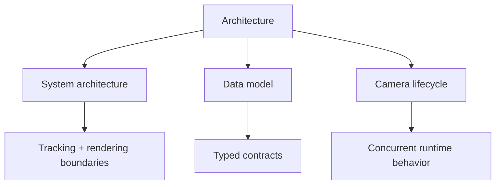

# 02 · Architecture

> **TL;DR** — The application is a staged real-time pipeline. Capture is already isolated behind a
> narrow API. Tracking and rendering will consume frames without changing capture semantics.

## Chapter map

- [System architecture](system-architecture.md) — components, boundaries, and future flow
- [Domain and runtime data model](data-model.md) — every current structure and invariant
- [Camera lifecycle](camera-lifecycle.md) — startup, running, failure, reconnect, and shutdown

## Architectural style

The code currently combines:

- **Pipeline architecture** for frame flow.
- **Ports and adapters** at the video-capture boundary.
- **Producer/consumer concurrency** with a single latest-value register.
- **Finite-state lifecycle management** for recovery and diagnostics.
- **Functional data contracts** through frozen dataclasses.

## Sources

- `src/kardboard_vtuber/camera/models.py:15-157`
- `src/kardboard_vtuber/camera/stream.py:20-288`
- `src/kardboard_vtuber/cli.py:54-150`

---

⬅️ [Foundations](../01-foundations/README.md) · ➡️
[Algorithms and data structures](../03-algorithms-and-data-structures/README.md)
