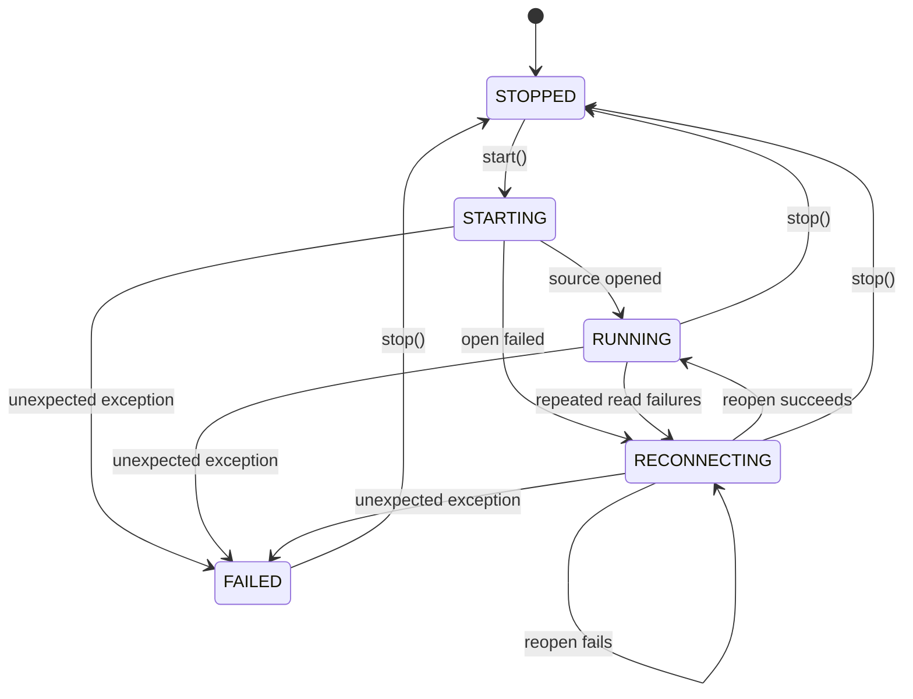
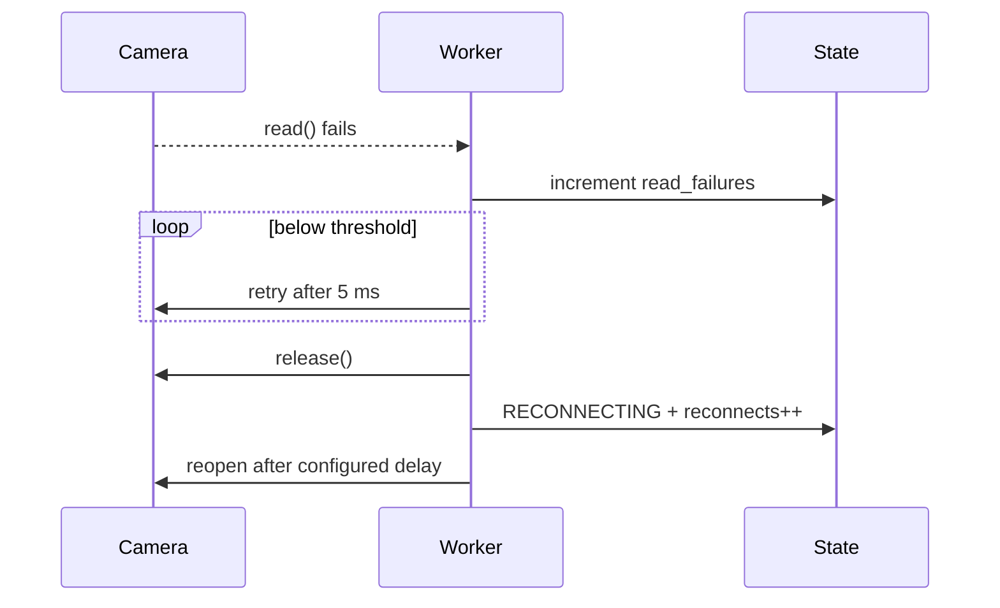

# Camera lifecycle

> **TL;DR** — Capture is modeled as a finite-state lifecycle rather than a Boolean “open” flag.
> Distinguishing startup, reconnection, terminal failure, and clean shutdown improves diagnostics
> and makes recovery behavior explicit.

## State machine

`CaptureState` is defined at `src/kardboard_vtuber/camera/models.py:51-58`.

## Startup

1. `start()` rejects duplicate worker creation.
2. State becomes `STARTING`.
3. A daemon thread runs `_run()`.
4. The caller waits for `RUNNING`, `FAILED`, or timeout.

Implementation: `src/kardboard_vtuber/camera/stream.py:78-97`.

## Normal operation

The worker opens the source, applies property requests, reads negotiated values, and continuously
publishes frames. Successful reads restore `RUNNING`.

Implementation: `src/kardboard_vtuber/camera/stream.py:167-220`.

## Temporary failure and reconnection

Repeated failures trigger `_disconnect()` at
`src/kardboard_vtuber/camera/stream.py:270-279`. The threshold is configurable and validated in
`models.py:104-119`.

## Terminal failure

Unexpected exceptions are not swallowed. The worker records a typed message, enters `FAILED`, and
wakes consumers (`stream.py:205-210`). `start()` and the CLI surface that failure.

## Shutdown

`stop()` sets an event, wakes waiters, joins the thread, releases the capture object, and publishes
`STOPPED` (`stream.py:99-112`). The class also supports `with LatestFrameCamera(...)`.

---

⬅️ [Data model](data-model.md) · ➡️
[Algorithms](../03-algorithms-and-data-structures/README.md)
