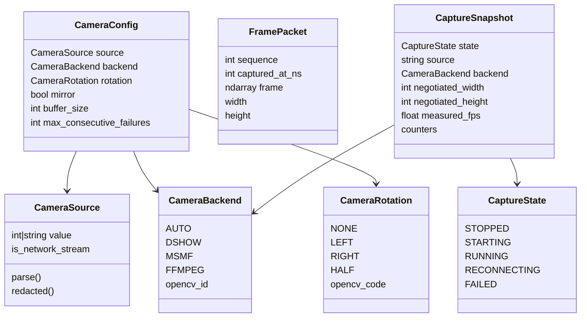
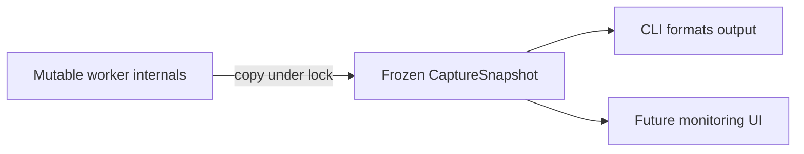

# Domain and runtime data model

> **TL;DR** — The current model separates user intent, one captured frame, lifecycle state, and
> diagnostics. This prevents mutable runtime details from leaking into configuration or UI code.

## Relationship diagram



## `CameraSource`

Defined at `src/kardboard_vtuber/camera/models.py:62-87`.

| Rule | Reason |
|---|---|
| Decimal strings become device indices | CLI input arrives as text |
| Other strings remain URLs/paths | OpenCV accepts string sources |
| Empty values fail immediately | Avoid meaningless reconnect loops |
| Credentials are redacted for display | Diagnostics must not leak secrets |

## `CameraConfig`

Defined at `src/kardboard_vtuber/camera/models.py:90-121`.

This is an immutable request, not observed truth. Width, height, FPS, and buffer size are offered to
the backend. The backend may ignore them. Observed values belong in `CaptureSnapshot`.

## `FramePacket`

Defined at `src/kardboard_vtuber/camera/models.py:124-138`.

| Field | Invariant |
|---|---|
| `sequence` | Strictly increases for every published frame |
| `captured_at_ns` | Uses a monotonic clock |
| `frame` | OpenCV BGR NumPy array |

Sequence numbers answer “is this newer than what I processed?” Timestamps answer “how old is this
inside the process?” They are deliberately separate.

## `CaptureSnapshot`

Defined at `src/kardboard_vtuber/camera/models.py:141-157`.

A snapshot is immutable and point-in-time. It contains:

- lifecycle state;
- redacted source and selected backend;
- negotiated width, height, and FPS;
- received, overwritten, failed-read, and reconnect counters;
- measured receive rate;
- last error.



## Why frozen and slotted?

- `frozen=True` makes accidental mutation fail.
- `slots=True` prevents undeclared fields and reduces per-instance overhead.
- Explicit fields make the contracts easy to test, serialize later, and explain.

## Tracking models

The tracker introduces a library-neutral `FaceTrackingState` containing landmarks, face bounds,
independent eye openness, mouth openness, and `HeadPose`
(`src/kardboard_vtuber/tracking/models.py:58-90`).

```python
class FaceTrackingState:
    head_pose: HeadPose
    left_eye_open: float
    right_eye_open: float
    mouth_open: float
    timestamp_ms: int
```

This prevents MediaPipe-specific result objects from contaminating the renderer.

---

⬅️ [System architecture](system-architecture.md) · ➡️ [Camera lifecycle](camera-lifecycle.md)
