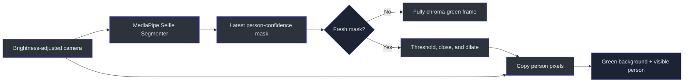
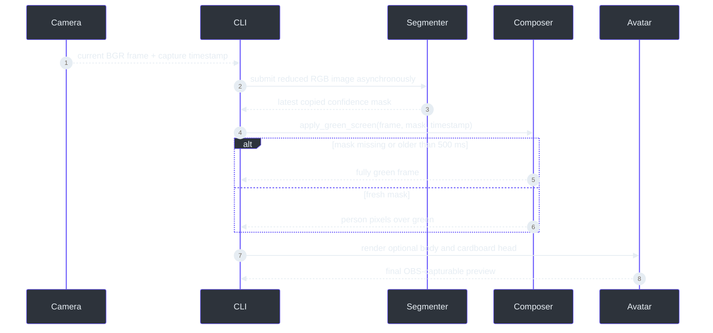

# Green-screen compositing

> **Status: implemented and opt-in through `--green-screen`.**
>
> **TL;DR** — The camera frame is segmented asynchronously. Detected person pixels remain visible,
> while every non-person pixel becomes pure OpenCV BGR green `(0, 255, 0)`. Missing or stale masks
> produce a fully green frame rather than exposing the room
> (`src/kardboard_vtuber/tracking/green_screen.py:16-152`).

## Overview

The mode exists for OBS chroma keying without requiring a physical green backdrop. It is separate
from face tracking: green-screen mode can run by itself, with the cardboard head, or with flap
physics. The CLI submits the original brightness-adjusted camera frame to segmentation before it
mutates the preview for composition (`src/kardboard_vtuber/cli.py:272-348`).



## Components

| Component | Responsibility | Evidence |
|---|---|---|
| `GreenScreenConfig` | Model path, input width, person threshold, stale-mask limit | `src/kardboard_vtuber/tracking/green_screen.py:16-32` |
| `PersonSegmentationState` | Immutable timestamp plus optional 2D confidence mask | `src/kardboard_vtuber/tracking/green_screen.py:35-42` |
| `MediaPipePersonSegmenter` | Reduced-resolution asynchronous LIVE_STREAM inference | `src/kardboard_vtuber/tracking/green_screen.py:45-121` |
| `apply_green_screen()` | Fail-closed chroma composition and mask cleanup | `src/kardboard_vtuber/tracking/green_screen.py:124-152` |
| CLI wiring | Submission before composition and deterministic cleanup | `src/kardboard_vtuber/cli.py:215-414` |
| Downloader | Official model URL plus pinned SHA-256 verification | `scripts/download_selfie_segmenter_model.py:1-52` |

## Runtime data flow



## Mask processing

The official Selfie Segmenter returns one floating-point person-confidence mask. The callback
copies and squeezes it to a stable 2D NumPy array because MediaPipe owns the callback image memory
(`src/kardboard_vtuber/tracking/green_screen.py:105-121`). Composition then:

1. copies the source frame;
2. fills output with exact chroma green;
3. rejects missing, future-dated, or stale masks;
4. resizes confidence to the source frame;
5. thresholds at `0.35`;
6. closes small holes and dilates once with a `5 × 5` elliptical kernel;
7. copies only accepted person pixels over green
   (`src/kardboard_vtuber/tracking/green_screen.py:124-152`).

The small dilation favors keeping hair, shoulders, and clothing over aggressively trimming the
person silhouette. This is a deliberate visual tradeoff, not metric depth reconstruction.

## Privacy behavior

Green-screen mode never uses an uninitialized mask as permission to show the background. Before
the first callback and after a mask becomes older than `500 ms`, output is entirely green
(`tests/test_green_screen.py:27-41`). This fail-closed rule is independent from the cardboard
renderer, whose own no-face behavior remains black-before-acquisition and last-safe-frame freezing
(`src/kardboard_vtuber/renderer/textured_3d.py:180-279`).

## Setup and operation

```powershell
python scripts\download_selfie_segmenter_model.py

python -m kardboard_vtuber `
  --source "YOUR_CAMERA_URL" `
  --rotate left `
  --mirror `
  --physics `
  --green-screen
```

The downloader verifies SHA-256
`191ac9529ae506ee0beefa6b2c945a172dab9d07d1e802a290a4e4038226658b`
before installing `models/selfie_segmenter.tflite`
(`scripts/download_selfie_segmenter_model.py:10-52`). MediaPipe remains an optional dependency
restricted to Python versions supported by the project tracking extra (`pyproject.toml:19-23`).

## Validation

Tests prove person preservation, exact green background replacement, stale-mask rejection, and
configuration validation (`tests/test_green_screen.py:1-47`). Runtime validation used the recorded
portrait camera feed and produced a complete person silhouette over pure green without including
that private camera frame in repository documentation.

## References

- `src/kardboard_vtuber/tracking/green_screen.py:1-152`
- `src/kardboard_vtuber/cli.py:32-652`
- `src/kardboard_vtuber/tracking/__init__.py:1-48`
- `scripts/download_selfie_segmenter_model.py:1-52`
- `tests/test_green_screen.py:1-47`
- `pyproject.toml:5-28`

---

⬅️ [Textured renderer](textured-3d-renderer.md) · 🏠 [Architecture](README.md)
