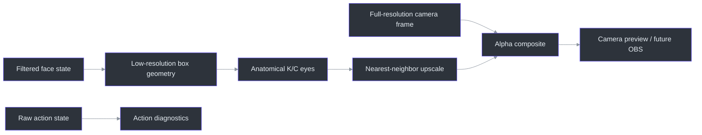
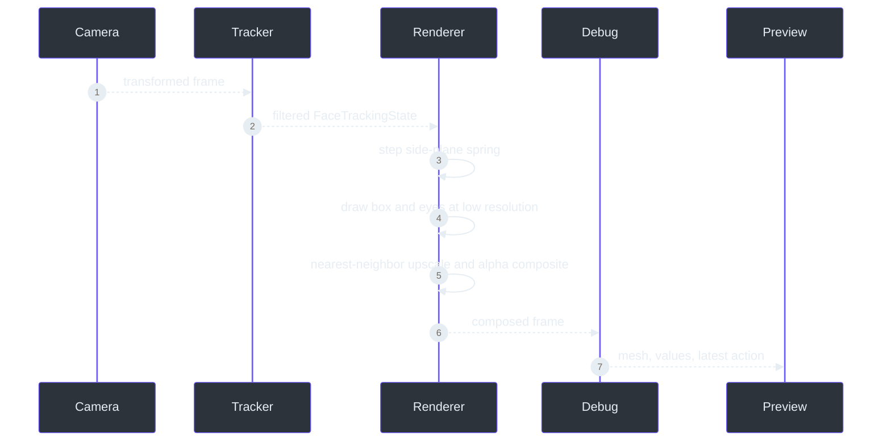

# PS1 cardboard renderer

> **Status: basic prototype implemented and offline-validated.**
>
> **TL;DR** — The renderer creates one fixed opaque hollow cardboard shell around the head at low
> resolution, leaves the neck visible through a central bottom opening, drives anatomical K/C eyes
> from tracking, adds pose-dependent planes and spring motion, then composites only
> the avatar over the sharp camera frame
> (`src/kardboard_vtuber/renderer/ps1_cardboard.py:17-370`).

## Why the renderer is deliberately fixed

The product needs one recognizable KardboardCode head, not a general avatar importer. A procedural
renderer therefore encodes the current character directly and avoids premature model formats,
scene graphs, asset pipelines, and user-facing rig editors
(`src/kardboard_vtuber/renderer/ps1_cardboard.py:35-272`,
`assets/PNGTuberV1/README.md`).



## Runtime sequence

The CLI automatically creates tracking when `--render-cardboard` is supplied. Rendering occurs
before the debug overlay so bounds, mesh, and action text remain visible over the prototype
(`src/kardboard_vtuber/cli.py:82-167`, `src/kardboard_vtuber/cli.py:253-256`).



## Visual construction

| Part | Implementation |
|---|---|
| Front panel | Skewed quadrilateral anchored to face center and bounds |
| Top plane | Lighter polygon that grows while looking down |
| Underside | Two dark lower polygons around the neck opening that grow while looking up |
| Side plane | Darker polygon shown opposite the screen direction of the face turn |
| Bottom opening | Central V-shaped cutout exposing the real neck |
| Interior rim | Dark lower-corner and opening surfaces that communicate hollow depth |
| K/C eyes | Text when open, upward happy-eye arcs when closed or winking |
| Surface | Deterministic light/dark fiber pattern over fully opaque cardboard |
| Pixel style | Overlay rendered at one-quarter linear resolution |
| Composition | Upscaled alpha mask blends avatar without pixelating camera |

MediaPipe landmarks bound the face, not the full hairstyle. The shell therefore uses additional
clearance in all three dimensions: `2.25x` tracked face width, `2.05x` tracked face height with a
`12%` upward center bias, and a `1.55x` depth multiplier. This larger envelope keeps hair, chin,
and side-profile pixels inside the opaque silhouette during combined pitch, yaw, and roll.

The visible logo order is always `K C` from screen-left to screen-right. In mirrored preview, each
letter retains its anatomical meaning: `K` follows the user's left eye and `C` follows the user's
right eye. Closure uses the calibrated wink rule (`<= 0.70` with an open opposite eye and at least
`0.15` asymmetry), plus the bilateral `<= 0.35` closed threshold
(`src/kardboard_vtuber/renderer/ps1_cardboard.py:284-339`,
`src/kardboard_vtuber/tracking/models.py:103-137`).

## Motion

Filtered bounds and pose control the box, while a damped spring adds intentional follow-through to
the side plane (`src/kardboard_vtuber/motion/springs.py:26-85`,
`src/kardboard_vtuber/renderer/ps1_cardboard.py:39-88`). Positive/rightward yaw reveals the
screen-left side; negative/leftward yaw reveals the screen-right side. The guided calibration
established a pitch baseline near `-10` degrees: more-negative pitch means looking up and reveals
the underside, while more-positive pitch means looking down and reveals the top. This preserves the
distinction between measurement smoothing and animation dynamics.

After all low-resolution planes, eyes, and openings are drawn, the complete color and alpha
canvases rotate together around the tracked center using filtered roll. Positive roll produces the
same counterclockwise screen tilt shown by the face mesh; roll is bounded to `+/-60` degrees.

Mouth-driven front flaps are intentionally deferred after visual review. The current prototype
renders no mouth flap geometry; mouth tracking and action diagnostics remain available for a later
redesign.

MediaPipe can lose the face when a full left or right profile hides too many frontal landmarks.
Privacy is fail-closed: before the first valid detection the output is black, and after tracking
loss the renderer freezes the last safely composited frame instead of emitting a new raw camera
frame. The narrow V opening apex is constrained below the tracked lower-face bound plus a
`16%` face-height chin/beard safety margin. The shell extends downward when necessary so the
opening exposes only the neck at every pitch.

## Validation

- The full 64-test suite passes under Python 3.12 and 3.13.
- Tests cover black output before initial acquisition, bounded overlay region, mirrored visible
  K/C placement, full lower-face and chin-margin opacity, and
  fail-closed tracking-loss freezing, crown/hair coverage, calibrated anatomical winks, roll,
  yaw-side perspective, pitch-driven top/underside visibility, enlarged XYZ dimensions, and an
  extreme combined-pose privacy silhouette. Default opaque composition uses a masked-copy fast
  path, while partial opacity retains tested alpha blending
  (`tests/test_ps1_cardboard_renderer.py:1-253`).
- The private guided recording produced a 1,254-frame prototype video.
- Contact-sheet inspection confirmed face coverage, pose following, K/C placement, and closed-eye
  arcs.

The private camera footage and rendered video are not committed.

The initial flat face-sized rectangle was rejected during user review. The corrected design is
approximately twice the tracked face width, extends around the head, remains fully opaque, and
reveals camera pixels only through the intentional neck opening
(`tests/test_ps1_cardboard_renderer.py:88-117`).

## Run it

```powershell
python -m kardboard_vtuber `
  --source "******PHONE_IP:8080/video" `
  --backend auto `
  --rotate left `
  --mirror `
  --render-cardboard
```

## References

- `src/kardboard_vtuber/renderer/ps1_cardboard.py:1-272`
- `src/kardboard_vtuber/renderer/__init__.py:1-8`
- `src/kardboard_vtuber/tracking/models.py:55-137`
- `src/kardboard_vtuber/motion/springs.py:1-85`
- `src/kardboard_vtuber/cli.py:82-256`
- `tests/test_ps1_cardboard_renderer.py:1-86`

---

⬅️ [System architecture](system-architecture.md) · 🏠 [Architecture](README.md)
