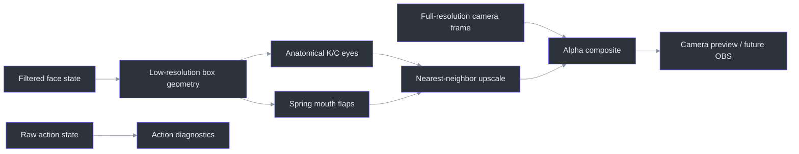

# PS1 cardboard renderer

> **Status: basic prototype implemented and offline-validated.**
>
> **TL;DR** — The renderer creates one fixed opaque hollow cardboard shell around the head at low
> resolution, leaves the neck visible through a central bottom opening, drives anatomical K/C eyes
> and front flaps from tracking, adds pose-dependent planes and spring motion, then composites only
> the avatar over the sharp camera frame
> (`src/kardboard_vtuber/renderer/ps1_cardboard.py:17-370`).

## Why the renderer is deliberately fixed

The product needs one recognizable KardboardCode head, not a general avatar importer. A procedural
renderer therefore encodes the current character directly and avoids premature model formats,
scene graphs, asset pipelines, and user-facing rig editors
(`src/kardboard_vtuber/renderer/ps1_cardboard.py:35-272`,
`assets/PNGTuberV1/README.md`).



## Runtime sequence

The CLI automatically creates tracking when `--render-cardboard` is supplied. Rendering occurs
before the debug overlay so bounds, mesh, and action text remain visible over the prototype
(`src/kardboard_vtuber/cli.py:82-167`, `src/kardboard_vtuber/cli.py:253-256`).


## Visual construction

| Part | Implementation |
|---|---|
| Front panel | Skewed quadrilateral anchored to face center and bounds |
| Top plane | Lighter cardboard polygon |
| Side plane | Darker polygon selected from yaw direction |
| Bottom opening | Wide central semicircular cutout exposing the real neck |
| Interior rim | Dark lower-corner and opening surfaces that communicate hollow depth |
| K/C eyes | Text when open, horizontal strokes when closed |
| Front flaps | Two spring-driven polygons controlled by mouth openness |
| Surface | Deterministic light/dark fiber pattern over fully opaque cardboard |
| Pixel style | Overlay rendered at one-quarter linear resolution |
| Composition | Upscaled alpha mask blends avatar without pixelating camera |

Mirrored preview places `C` on screen-left and `K` on screen-right because those positions correspond
to the user's anatomical right and left eyes respectively
(`src/kardboard_vtuber/renderer/ps1_cardboard.py:167-235`,
`src/kardboard_vtuber/tracking/models.py:103-137`).

## Motion

Filtered bounds and pose control the box, while damped springs add intentional follow-through to
mouth and side planes (`src/kardboard_vtuber/motion/springs.py:26-85`,
`src/kardboard_vtuber/renderer/ps1_cardboard.py:39-88`). This preserves the distinction between
measurement smoothing and animation dynamics.

## Validation

- 41 unit tests pass under Python 3.12 and 3.13.
- Tests cover no-face passthrough, bounded overlay region, mouth-dependent flap changes, and mirrored
  anatomical eye placement (`tests/test_ps1_cardboard_renderer.py:1-86`).
- The private guided recording produced a 1,254-frame prototype video.
- Contact-sheet inspection confirmed face coverage, pose following, K/C placement, closed-eye
  strokes, and open mouth flaps.

The private camera footage and rendered video are not committed.

The initial flat face-sized rectangle was rejected during user review. The corrected design is
approximately twice the tracked face width, extends around the head, remains fully opaque, and
reveals camera pixels only through the intentional neck opening
(`tests/test_ps1_cardboard_renderer.py:88-106`).

## Run it

```powershell
python -m kardboard_vtuber `
  --source "******PHONE_IP:8080/video" `
  --backend auto `
  --rotate left `
  --mirror `
  --render-cardboard
```

## References

- `src/kardboard_vtuber/renderer/ps1_cardboard.py:1-272`
- `src/kardboard_vtuber/renderer/__init__.py:1-8`
- `src/kardboard_vtuber/tracking/models.py:55-137`
- `src/kardboard_vtuber/motion/springs.py:1-85`
- `src/kardboard_vtuber/cli.py:82-256`
- `tests/test_ps1_cardboard_renderer.py:1-86`

---

⬅️ [System architecture](system-architecture.md) · 🏠 [Architecture](README.md)
