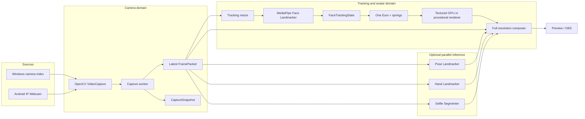
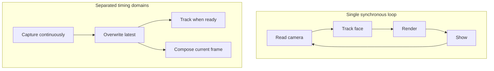
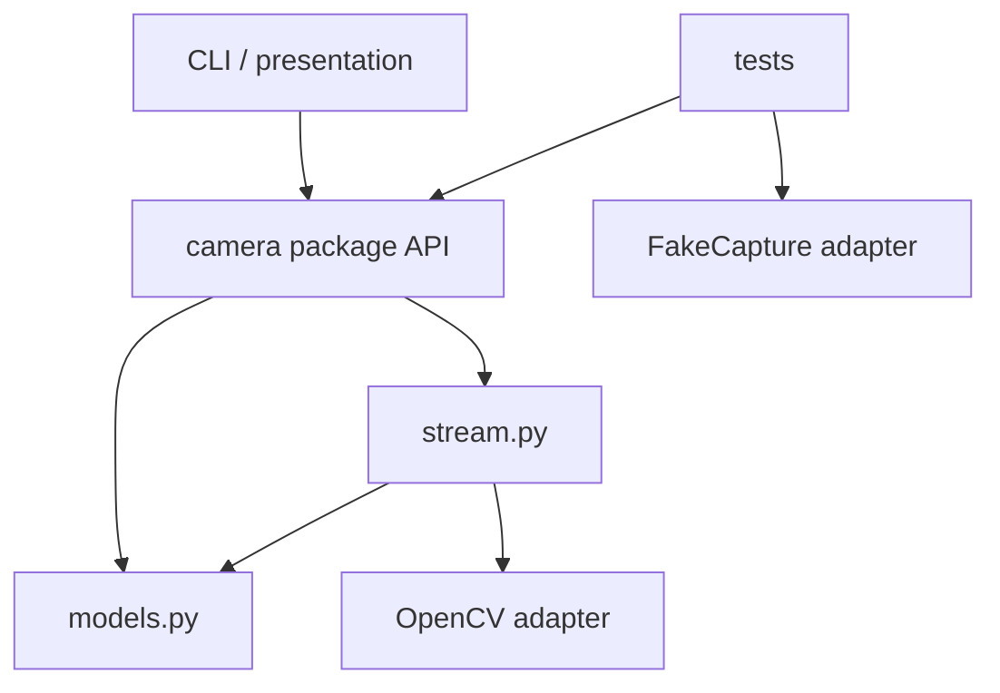

# System architecture

> **TL;DR** — Capture, tracking, rendering, composition, and presentation are separate stages with
> different performance characteristics. The system passes small contracts between stages rather
> than allowing one library to own the entire application.

## End-to-end runtime

## Component boundaries

### Configuration boundary

`CameraConfig` contains requested behavior. It validates impossible values early but never claims
that hardware accepted a request (`src/kardboard_vtuber/camera/models.py:90-121`).

### Capture boundary

`VideoCaptureLike` describes the OpenCV methods the worker needs
(`src/kardboard_vtuber/camera/stream.py:20-29`). This protocol is the seam used by tests.

### Concurrency boundary

`LatestFrameCamera` owns the thread, capture handle, condition variable, latest packet, counters, and
lifecycle (`src/kardboard_vtuber/camera/stream.py:39-73`).

### Presentation boundary

The CLI reads packets, submits optional asynchronous inference, orders green-screen/body/head/hand
composition, gates diagnostics behind `--tracking-debug`, and displays the preview
(`src/kardboard_vtuber/cli.py:215-414`). It does not implement capture or reconnection.

## Why not one giant loop?

A synchronous loop makes camera ingestion wait for every expensive downstream stage. Separation
lets capture stay current even when inference or rendering slows down.

## Dependency direction

Higher-level code depends on project abstractions. OpenCV-specific constants are translated by
`CameraBackend.opencv_id` and `CameraRotation.opencv_code`
(`src/kardboard_vtuber/camera/models.py:15-48`).

## Stable extension seams

- Trackers consume transformed frame data, not `VideoCapture`.
- Renderers consume normalized project-owned tracking state, not raw MediaPipe objects.
- Compositors consume the current full frame plus project-owned masks or rendered overlays.
- OBS transport should consume composed output and remain independent of tracking.

These seams are implemented in the camera, tracking, renderer, and CLI packages
(`src/kardboard_vtuber/tracking/models.py:15-100`,
`src/kardboard_vtuber/renderer/__init__.py:1`,
`src/kardboard_vtuber/tracking/green_screen.py:124-152`).

---

⬅️ [Architecture](README.md) · ➡️ [Data model](data-model.md)
