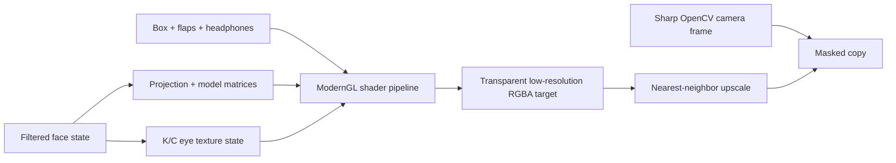

# Textured GPU 3D renderer

> **Status: implemented as the default cardboard renderer.**
>
> **TL;DR** — Python remains the application runtime. OpenCV handles camera frames and final
> compositing, MediaPipe provides face state, and ModernGL renders a textured low-poly 3D character
> into a transparent offscreen framebuffer.

## Why the architecture changed

The procedural OpenCV renderer proved tracking, privacy, perspective rules, and fail-closed
behavior, but it could not provide real perspective surfaces, depth-tested headphones, textured
corrugated edges, or coherent lighting. The canonical target requires a real 3D rasterizer.

ModernGL creates a headless OpenGL 3.3 context on the Windows GPU. No Unity runtime or Blender
installation is required. The first character asset is generated procedurally in Python, so the
repository remains source-runnable.

## Runtime flow



## Character construction

`src/kardboard_vtuber/renderer/textured_3d.py` builds:

- a front shell with a protected V-shaped neck opening;
- left, right, top, and rear depth surfaces;
- a matching rear opening so the bottom remains hollow;
- a faceted dark privacy volume positioned between the front and rear faces, with an elongated
  lower silhouette and protected rear-panel channel that visually connect it to the real neck
  during upward pitch without exposing hair, chin, or beard;
- optional asynchronous hand landmarks and an image-space hand/forearm mask that restore real
  foreground pixels over the avatar for approximate monocular AR occlusion; the mask uses a palm
  polygon plus separate finger capsules so avatar pixels remain intact between fingers;
- front and side cardboard flaps;
- layered dark/light edge bars that suggest corrugated cardboard;
- faceted earcups, cushions, and a segmented headphone band;
- a deterministic texture atlas containing cardboard variation, tape, shipping marks, K/C eyes,
  and happy-eye wink arcs.

The fragment shader applies directional light, five-level light posterization, and 5-bit color
quantization. The renderer works at one-third linear resolution and upscales with nearest-neighbor
sampling for stable PS1-style pixels.

## Pose and privacy

Tracked center and face dimensions determine translation and non-uniform XYZ scale. Pitch, yaw,
and roll drive the model matrix. The established calibration remains authoritative:

- positive yaw exposes the screen-left side;
- negative yaw exposes the screen-right side;
- positive/downward pitch reveals the top;
- negative/upward pitch reveals the hollow underside;
- positive roll rotates counterclockwise on screen.

Before the first face detection the output is black. During tracking loss the renderer freezes the
last safely composited frame. If the OpenGL context cannot be created, the CLI reports the failure
and falls back to the procedural privacy-safe renderer.

While the avatar is active, sparse full-frame landmarks and the green face rectangle are suppressed.
The connected face mesh and XYZ pose axes remain available inside the dedicated top-right inset, so
diagnostics do not visually appear inside the cardboard shell.

## Performance and validation

- AMD Radeon 780M offscreen context verified with OpenGL 3.3.
- Measured renderer cost at 1080x1920: approximately `8.17 ms/frame`.
- Measured isolated rendering ceiling: approximately `122 FPS`.
- Six-pose saved-frame inspection covers neutral, both yaw directions, up/down pitch, roll, and
  anatomical wink rendering.
- Python 3.12 and Python 3.13 test suites cover mesh shape, texture state, fail-closed behavior, and
  GPU compositing.

Private camera previews and the canonical target image are not committed.

## Run it

```powershell
python -m kardboard_vtuber `
  --source "YOUR_CAMERA_URL" `
  --rotate left `
  --mirror `
  --render-cardboard
```

The default is `--cardboard-renderer textured-3d`. Use
`--cardboard-renderer procedural-2d` only for comparison or GPU troubleshooting.
