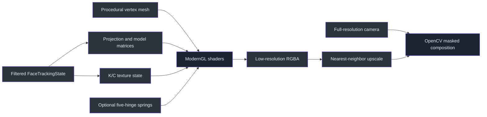
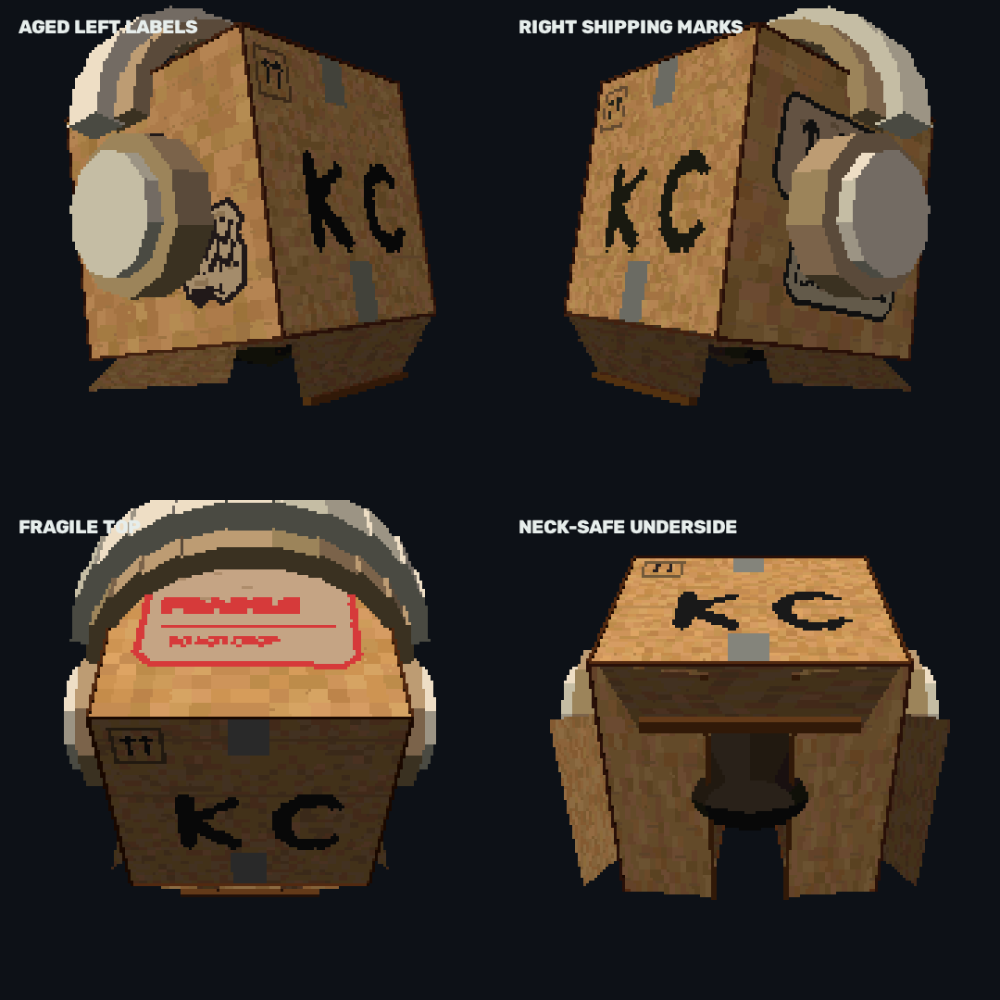
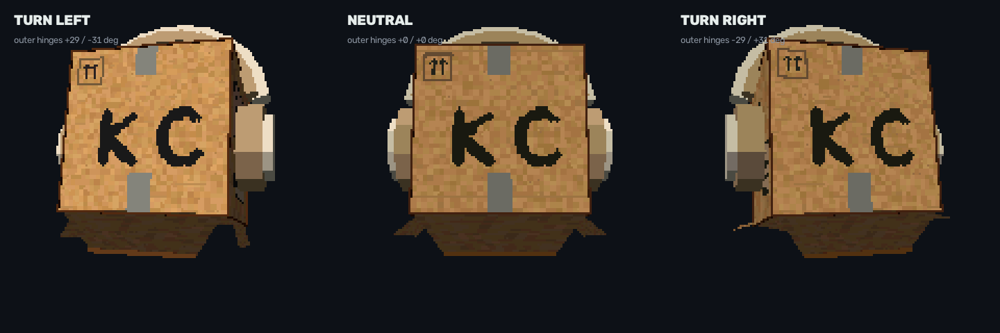
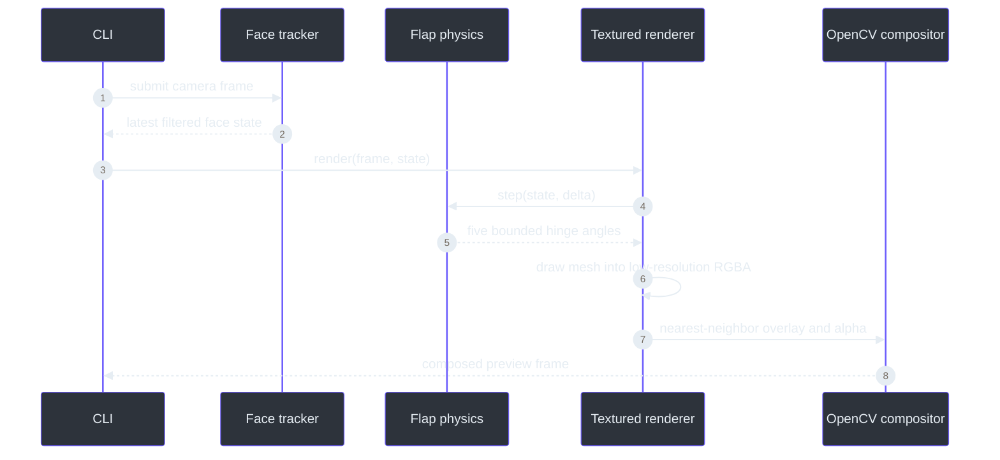

# Textured GPU 3D renderer

> **Status: implemented as the default cardboard renderer.**
>
> **TL;DR** — ModernGL renders a procedurally generated cubic cardboard character into a
> transparent low-resolution framebuffer. The current model includes the complete front face,
> neck-safe underside, headphones, aged shipping decals, independent K/C expressions, five
> optional spring hinges, and a configurable perspective depth offset
> (`src/kardboard_vtuber/renderer/textured_3d.py:111-327`).

  

## Why this renderer exists

The procedural OpenCV renderer proved tracking, pose signs, compositing, and fail-closed privacy,
but it cannot provide coherent depth-tested surfaces or real 3D headphone geometry. The default
renderer therefore keeps Python and OpenCV as the application shell while delegating the avatar to
an offscreen OpenGL 3.3 pipeline (`src/kardboard_vtuber/renderer/ps1_cardboard.py:35-253`,
`src/kardboard_vtuber/renderer/textured_3d.py:140-276`).

## Six-sided turnaround

  

The image is generated from the same `_build_character_mesh()` and shader path used at runtime; it
contains no camera pixels (`src/kardboard_vtuber/renderer/textured_3d.py:532-748`).

## Geometry inventory

| Surface or part | Current implementation |
|---|---|
| Front | One complete rectangular textured quad; the former lower V cut and red boxed-X stamp are removed |
| Side walls | Full left and right cardboard faces with dedicated atlas regions |
| Top | Full cardboard face carrying the aged `FRAGILE` label |
| Rear | Upper rear panel plus lower panels around an open neck channel |
| Underside | Two inward closure panels, one broad front-hinged flap, and a central front-to-rear neck channel |
| Privacy core | Opaque faceted ellipsoid covering hair, face, chin, and beard behind the visible shell |
| External tabs | Two cardboard tabs attached to the lower outside side edges |
| Headphones | Segmented cream band, inset light-beige cushion, annular ear cushions, protruding cream earcups |
| Edge definition | Thin low-contrast dark-brown bars on cube edges without a raised front border |

The cube side length is the larger of the requested face-derived width and height and is applied
uniformly to X, Y, and Z, preserving a cubic shell
(`src/kardboard_vtuber/renderer/textured_3d.py:280-327`,
`tests/test_textured_3d_renderer.py:351-368`).

## Detailed views

  

### Texture atlas and aged decals

The deterministic `1024 × 512` atlas contains cardboard noise, corrugation lines, tape, face
markings, dedicated side regions, and a top region
(`src/kardboard_vtuber/renderer/textured_3d.py:984-1029`). The current labels use:

- dirty beige paper rather than clean white;
- missing and notched corners;
- independent irregular tear silhouettes on the two left-side labels;
- non-repeating stain placement;
- hard low-resolution barcode bars;
- coarse nearest-neighbor lettering, including the red `FRAGILE` and `DO NOT DROP` text;
- no red boxed-X stamp on the front face
  (`src/kardboard_vtuber/renderer/textured_3d.py:1030-1230`,
  `tests/test_textured_3d_renderer.py:245-322`).

### K/C expression system

  

K and C are custom irregular painted paths, not font glyphs. They are rasterized on a seven-pixel
grid using one flat ink color and then enlarged as square blocks. Wink and blink arcs use the same
coarse mask, preserving independent anatomical left/right control
(`src/kardboard_vtuber/renderer/textured_3d.py:1248-1350`,
`tests/test_textured_3d_renderer.py:324-350`).

## Five-hinge flap physics

`--physics` creates five underdamped springs and enables per-vertex hinge IDs in the vertex shader
(`src/kardboard_vtuber/renderer/textured_3d.py:15-89`,
`src/kardboard_vtuber/renderer/textured_3d.py:329-472`).

| Hinge | Axis and pivot | Primary inputs | Limit |
|---|---|---|---:|
| Left inward underside panel | Z axis at left lower box edge | roll, yaw, horizontal movement | 26° |
| Right inward underside panel | Z axis at right lower box edge | roll, yaw, horizontal movement | 26° |
| Broad front underside flap | X axis at front lower edge | pitch and vertical movement | 24° |
| Left external side tab | Z axis at left outside edge | highly amplified yaw and horizontal movement | 42° |
| Right external side tab | Z axis at right outside edge | highly amplified yaw and horizontal movement | 42° |

  

The springs use bounded semi-implicit Euler integration from the shared `DampedSpring` primitive.
Large timestamp gaps reset motion rather than integrating stale impulses
(`src/kardboard_vtuber/motion/springs.py:26-85`,
`tests/test_motion_springs.py:18-71`).

## Frame data flow

The CLI orders optional full-body rendering before the head, then restores the hand/forearm
foreground after the head when hand occlusion is enabled
(`src/kardboard_vtuber/cli.py:215-414`,
`src/kardboard_vtuber/renderer/full_body.py:32-187`,
`src/kardboard_vtuber/tracking/hand_occlusion.py:137-213`).

## Perspective, pose, and depth

Pitch, yaw, and roll build the model matrix:

- positive yaw exposes the physical left side;
- negative yaw exposes the physical right side;
- positive pitch reveals the top;
- negative pitch reveals the underside;
- positive roll rotates counterclockwise on screen
  (`src/kardboard_vtuber/renderer/textured_3d.py:280-327`).

`perspective_depth_offset` defaults to `0.16`, moving the entire model farther from the camera.
`--box-depth-offset 0` restores the previous position. Finite positive values have no upper cap,
but large values reduce projected coverage and can expose the real head
(`src/kardboard_vtuber/renderer/textured_3d.py:111-137`,
`src/kardboard_vtuber/cli.py:122-130`).

## Privacy invariants

The renderer deliberately separates decorative openness from privacy coverage:

1. Before the first detected face, output is black.
2. After a safe render, face-tracking loss freezes the last safe frame.
3. The internal opaque head volume remains static even when visible flaps move.
4. The complete front face does not contain a neck cut.
5. The real neck remains visible only through the underside channel.
6. Arbitrary RGB-only object occlusion is unsupported; only the bounded hand/forearm mask may
   restore camera pixels over the avatar
   (`src/kardboard_vtuber/renderer/textured_3d.py:180-279`,
   `src/kardboard_vtuber/tracking/hand_occlusion.py:137-213`,
   `tests/test_textured_3d_renderer.py:371-409`).

## Configuration

| Option | Default | Effect |
|---|---:|---|
| `pixel_scale` | `3` | Render at one-third linear resolution |
| `box_width_multiplier` | `2.25` | Requested shell width from tracked face |
| `box_height_multiplier` | `2.05` | Requested shell height from tracked face |
| `upward_bias` | `0.12` | Raises the shell above landmark center |
| `fov_degrees` | `42` | Perspective projection field of view |
| `perspective_depth_offset` | `0.16` | Moves the model backward on camera Z |
| `physics_enabled` | `False` | Enables the five hinge springs |

The CLI exposes depth as `--box-depth-offset` and physics as `--physics`
(`src/kardboard_vtuber/cli.py:120-136`,
`src/kardboard_vtuber/cli.py:632-652`).

## Performance and validation

- Rendering occurs at one-third linear resolution and is enlarged with nearest-neighbor sampling.
- The fragment shader posterizes lighting to five levels and quantizes output to 5-bit color.
- The validated AMD Radeon 780M environment measured approximately `8.17 ms` per 1080×1920 frame.
- Automated coverage includes mesh shape, atlas regions, aged decals, expressions, hinge IDs,
  hinge sensitivity, depth offset, fail-closed output, and neck visibility
  (`tests/test_textured_3d_renderer.py:1-409`).

## References

- `src/kardboard_vtuber/renderer/textured_3d.py:1-1414`
- `src/kardboard_vtuber/renderer/full_body.py:1-187`
- `src/kardboard_vtuber/motion/springs.py:1-85`
- `src/kardboard_vtuber/tracking/hand_occlusion.py:1-213`
- `src/kardboard_vtuber/tracking/models.py:15-100`
- `src/kardboard_vtuber/cli.py:32-652`
- `tests/test_textured_3d_renderer.py:1-409`

---

⬅️ [Architecture](README.md) · ➡️ [Green-screen compositing](green-screen-compositing.md)
