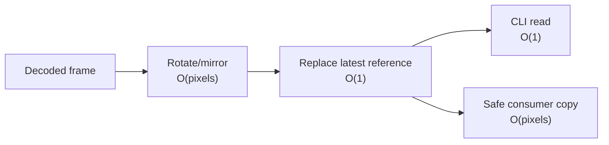

# 03 · Algorithms and data structures

> **TL;DR** — The current subsystem uses four important ideas: a single latest-value slot, a
> condition variable, a finite-state machine, and monotonic sliding-window timing. Each has its own
> chapter because each solves a different real-time systems problem.

## Current algorithm catalogue

| Chapter | Data structure / algorithm | Problem solved |
|---|---|---|
| [Latest-frame slot](latest-frame-slot.md) | One mutable reference + sequence | Prevent latency-producing queues |
| [Condition-variable synchronization](condition-variable-synchronization.md) | `threading.Condition` | Coordinate producer, consumers, lifecycle, and timeouts |
| [Finite-state lifecycle](finite-state-lifecycle.md) | Enum state machine + retry threshold | Make recovery behavior explicit |
| [Monotonic timing and FPS](monotonic-timing-and-fps.md) | Monotonic timestamp + time window | Measure age and throughput safely |
| [Asynchronous live inference](asynchronous-live-inference.md) | Non-blocking submission + latest result | Keep inference out of the preview critical path |
| [Blendshape normalization](blendshape-normalization.md) | Lookup, inversion, and clamping | Produce stable eye and mouth controls |
| [Transformation matrix decomposition](transformation-matrix-decomposition.md) | 4x4 validation + 3x3 RQ decomposition | Expose renderer-friendly pose diagnostics |

## Complexity summary

| Operation | Time | Additional space |
|---|---:|---:|
| Publish frame | O(1) reference replacement | O(1) frames |
| Read latest without copy | O(1) | O(1) |
| Read latest with copy | O(width × height) | One frame copy |
| Snapshot diagnostics | O(1) | O(1) |
| Update FPS window | O(1) | O(1) |

## Future algorithm chapters

When implemented, the book will add dedicated chapters for:

- One Euro filtering.
- Quaternion smoothing.
- Damped spring integration.
- Alpha compositing.
- Nearest-neighbor scaling.
- Ordered dithering and optional vertex snapping.

These are not yet implemented and should not be presented as current behavior.

---

⬅️ [Architecture](../02-architecture/README.md) · ➡️
[Design principles](../04-design-principles/README.md)
