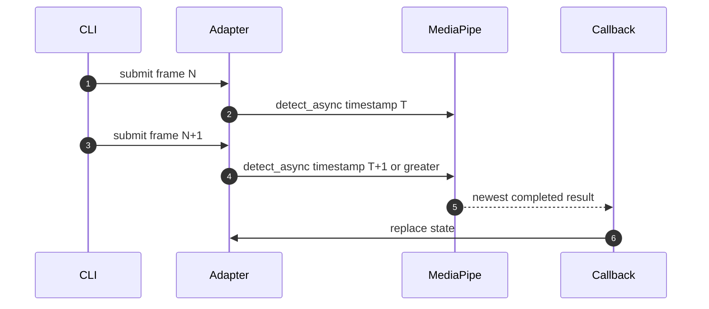

# Asynchronous latest-result face inference

> **TL;DR** — Camera capture and face inference run in separate timing domains. The CLI submits
> current frames without waiting for inference and consumes the newest completed tracking result.

## Algorithm

```text
for each newest camera packet:
    downscale packet.frame
    convert BGR to RGB
    submit with strictly increasing timestamp
    continue preview loop

on MediaPipe callback:
    normalize result
    replace latest tracking state
```

Submission is implemented at
`src/kardboard_vtuber/tracking/mediapipe_tracker.py:102-119`; callback publication is at
`src/kardboard_vtuber/tracking/mediapipe_tracker.py:143-175`.


## Timestamp monotonicity

MediaPipe live mode requires increasing millisecond timestamps. Camera timestamps are nanoseconds,
so integer conversion can theoretically produce duplicates. The adapter enforces:

```text
timestamp_ms = max(captured_ns // 1_000_000, last_timestamp_ms + 1)
```

This is protected by the tracker lock (`mediapipe_tracker.py:105-109`).



## Complexity and memory

- Preprocessing: O(input pixels).
- Submission bookkeeping: O(1).
- Retained tracking memory: one state plus its landmarks.
- No application-level inference queue.

## Why not `detect_for_video()`?

Synchronous video mode would block the preview loop on every inference. Live-stream mode lets
MediaPipe manage inference asynchronously and may drop inputs when busy, matching the product's
freshness-over-completeness principle.

## References

- `src/kardboard_vtuber/camera/stream.py:114-141`
- `src/kardboard_vtuber/tracking/mediapipe_tracker.py:44-175`
- `src/kardboard_vtuber/tracking/models.py:58-90`
- `src/kardboard_vtuber/cli.py:82-105`
- `pyproject.toml:16-23`

---

⬅️ [Algorithm catalogue](README.md) · ➡️ [Blendshape normalization](blendshape-normalization.md)
