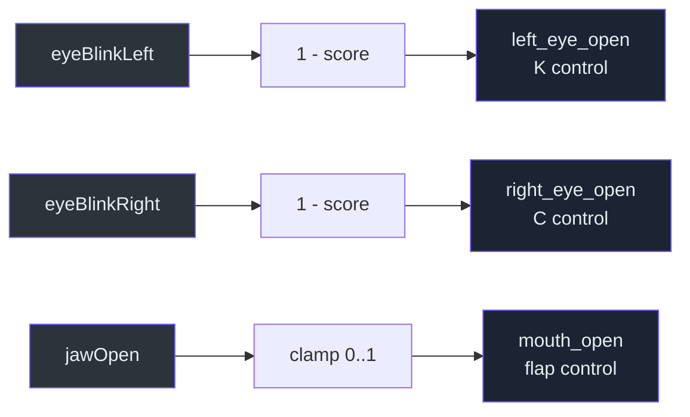
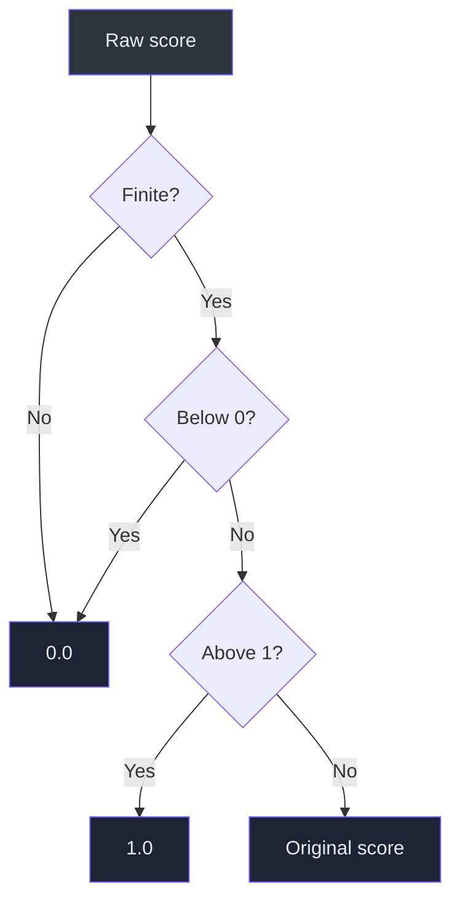

# Blendshape normalization

> **TL;DR** — MediaPipe reports blink intensity, while the avatar needs eye openness. The adapter
> inverts blink scores and clamps every control to a finite `[0, 1]` range.

## Mapping

| MediaPipe category | Project control | Formula |
|---|---|---|
| `eyeBlinkLeft` | `left_eye_open` | `1 - clamp(score)` |
| `eyeBlinkRight` | `right_eye_open` | `1 - clamp(score)` |
| `jawOpen` | `mouth_open` | `clamp(score)` |

Implementation: `src/kardboard_vtuber/tracking/models.py:122-134`.

## Defensive normalization

`_clamp01()` converts non-finite values to zero and bounds valid numbers
(`src/kardboard_vtuber/tracking/models.py:148-151`).

## Why calibration still matters

Raw scores vary by face, glasses, lighting, camera angle, and model behavior. Future calibration
will map personal neutral/closed/open ranges into renderer controls. The current normalization is a
safe common scale, not final animation tuning.

## Test evidence

- Correct eye inversion and jaw extraction:
  `tests/test_tracking_models.py:40-66`
- Invalid and out-of-range score handling:
  `tests/test_tracking_models.py:82-101`

## References

- `src/kardboard_vtuber/tracking/models.py:93-151`
- `src/kardboard_vtuber/tracking/mediapipe_tracker.py:143-166`
- `tests/test_tracking_models.py:1`
- `assets/PNGTuberV1/model-manifest.json:116-149`
- `docs/01-foundations/visual-identity-and-source-avatar.md`

---

⬅️ [Async inference](asynchronous-live-inference.md) · ➡️
[Transformation matrix](transformation-matrix-decomposition.md)
