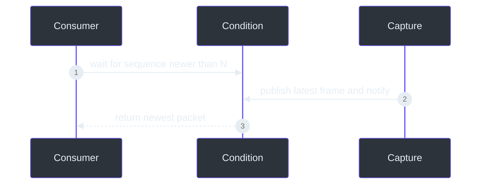
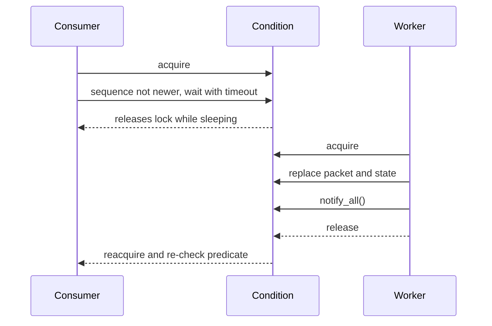

# Condition-variable synchronization

> **TL;DR** — One `threading.Condition` protects shared capture state and lets consumers sleep until
> a new frame or lifecycle change occurs. This avoids both unsafe races and wasteful polling.

## Why a condition variable?

A mutex alone protects data but cannot efficiently express “wait until a newer sequence exists.”
An event can signal something happened but does not naturally protect the packet and counters.
A condition combines both.

The condition is created at `src/kardboard_vtuber/camera/stream.py:55`.

## The predicate loop

Consumers use a loop because wakeups are notifications, not guarantees:

1. Inspect `_latest`.
2. Check whether it is newer than `after_sequence`.
3. Return it if valid.
4. Return `None` if the lifecycle is terminal.
5. Otherwise wait for notification or timeout.

Implementation: `stream.py:124-141`.

## Shared state protected by the condition

- Latest packet.
- Lifecycle state.
- Sequence and diagnostic counters.
- Negotiated camera properties.
- Last error.

## Why `notify_all()`?

The current CLI has one consumer, but lifecycle waiters and future tracker/composer consumers may
coexist. Every waiter must re-check its own predicate after a publication or state change.

## Lock granularity

The worker does **not** hold the condition while `capture.read()` blocks or while OpenCV transforms
the frame. It acquires the lock only to publish compact state. That prevents slow I/O from blocking
diagnostic reads and shutdown coordination.

## Risk: frame ownership

`read(copy=True)` copies the NumPy array under the lock. The CLI uses `copy=False` because it
consumes the frame immediately (`src/kardboard_vtuber/cli.py:74`). Future asynchronous consumers
must either request a copy or guarantee ownership.

---

⬅️ [Latest-frame slot](latest-frame-slot.md) · ➡️
[Finite-state lifecycle](finite-state-lifecycle.md)
