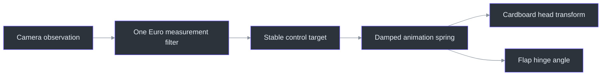
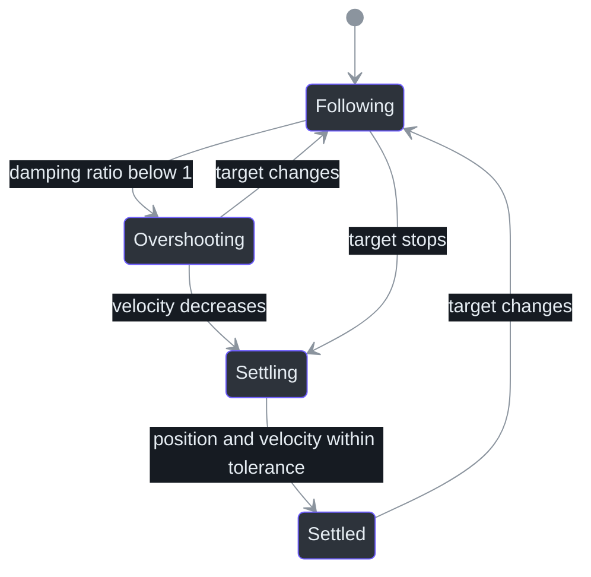

# Damped spring integration

> **Status: dynamics implemented and tested; renderer wiring is the next milestone.**
>
> **TL;DR** — A damped harmonic oscillator gives the cardboard head and flaps controlled lag,
> settling, and optional overshoot. `DampedSpring` uses semi-implicit Euler integration with bounded
> internal steps so behavior remains similar across rendering frame rates
> (`src/kardboard_vtuber/motion/springs.py:10-85`).

## Why a spring is separate from filtering

One Euro filtering estimates a cleaner measurement. A spring creates intentional animation.
Combining these responsibilities would make tracking latency indistinguishable from artistic
secondary motion (`src/kardboard_vtuber/tracking/filters.py:32-75`,
`src/kardboard_vtuber/motion/springs.py:26-85`).



## Physical model

For a unit mass:

```text
acceleration = stiffness * (target - position) - damping * velocity
stiffness = angular_frequency²
damping = 2 * damping_ratio * angular_frequency
```

The implementation updates velocity before position, which is semi-implicit Euler. A frame delta
is divided into steps no larger than `1/120` second to reduce frame-rate dependence and unstable
large jumps (`src/kardboard_vtuber/motion/springs.py:49-67`).

| Parameter | Meaning | Default |
|---|---|---:|
| `frequency_hz` | How quickly the spring reacts | `4.0` |
| `damping_ratio` | `1` critical, `<1` overshoots, `>1` sluggish | `0.7` |
| `maximum_step_seconds` | Largest internal integration step | `1/120` |



## Intended renderer use

- Critically or near-critically damped springs for head translation and scale.
- Restrained underdamped springs for cardboard side flaps.
- Mouth value as the front-flap target, with spring dynamics providing hinge follow-through.
- Reset springs on prolonged tracking loss rather than integrating toward stale targets.

These consumers are not yet wired because the low-resolution renderer does not exist. The tested
primitive is ready for that milestone (`src/kardboard_vtuber/motion/__init__.py:1-5`,
`docs/08-roadmap/README.md`).

## Validation

Tests prove critical damping converges without overshoot, underdamping produces secondary
overshoot, bounded substeps keep 30 and 120 FPS results close, reset establishes a new state, and
negative time fails explicitly (`tests/test_motion_springs.py:1-72`).

## Complexity

Each internal step is O(1) time and O(1) space. For a frame delta `dt`, work is
O(`ceil(dt / maximum_step_seconds)`), which is normally four steps at 30 FPS.

## References

- `src/kardboard_vtuber/motion/springs.py:1-85`
- `src/kardboard_vtuber/motion/__init__.py:1-5`
- `src/kardboard_vtuber/tracking/filters.py:1-175`
- `src/kardboard_vtuber/tracking/models.py:55-100`
- `src/kardboard_vtuber/tracking/mediapipe_tracker.py:88-199`
- `tests/test_motion_springs.py:1-72`

---

⬅️ [One Euro filtering](one-euro-filtering.md) · 🏠
[Algorithms and data structures](README.md)
