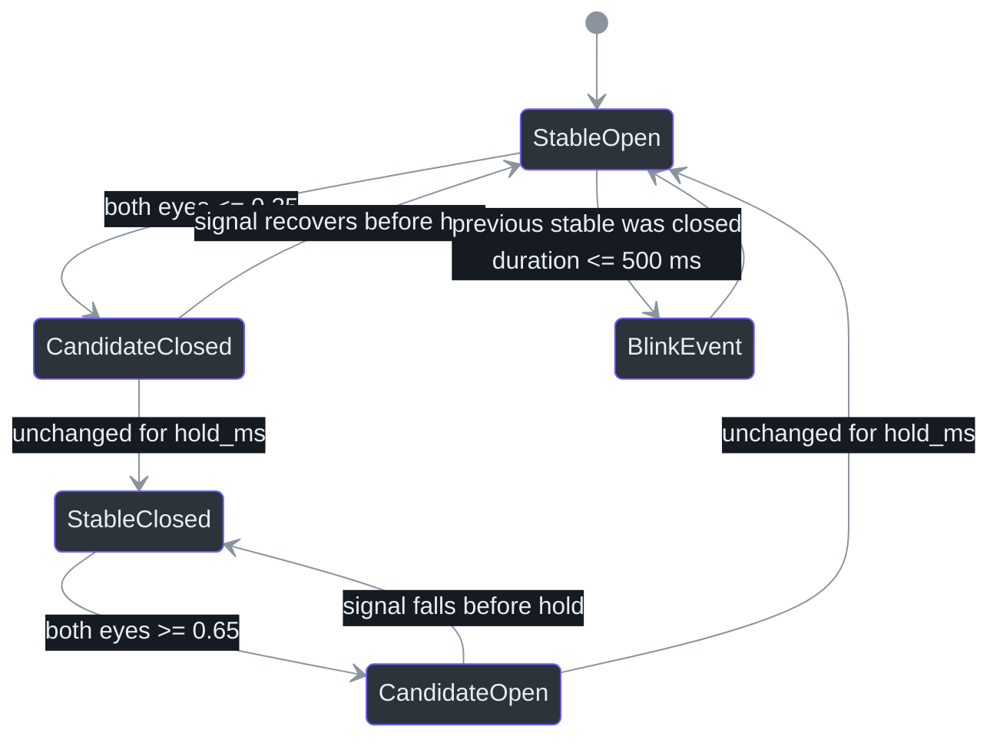
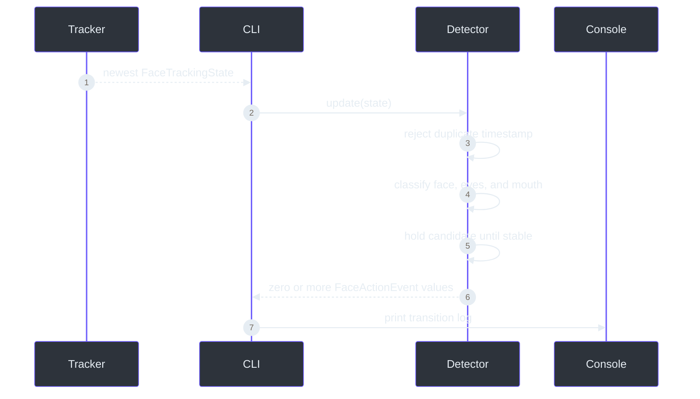

# Facial action state machine

> **Status: implemented and live-validated.**
>
> **TL;DR** — MediaPipe produces continuous values every frame, but logs and future avatar actions
> need discrete transitions. `FaceActionDetector` applies hysteresis, a stability hold, and
> timestamp ordering to emit low-noise events without logging every frame
> (`src/kardboard_vtuber/tracking/events.py:73-171`).

## Why a state machine exists

An eye value moving from `0.72` to `0.69` is useful tracking data, but it is not a new user action.
The detector therefore separates the latest measurement, a candidate state, and the last stable
state. A candidate must remain unchanged for `hold_ms` before it becomes stable
(`src/kardboard_vtuber/tracking/events.py:66-70`,
`src/kardboard_vtuber/tracking/events.py:150-168`).

## Event catalogue

| Event | Classification rule | Purpose |
|---|---|---|
| `face_detected` / `face_lost` | Debounced `detected` transition | Tracking lifecycle |
| `eyes_open` | Both values at or above `0.65` | Neutral/open-eye state |
| `eyes_closed` | Both values at or below `0.35` | Closed-eye state |
| `left_wink` | Left closed while right open | Independent `K` eye control |
| `right_wink` | Right closed while left open | Independent `C` eye control |
| `blink` | Closed-to-open within 500 ms | Short bilateral closure |
| `mouth_open` / `mouth_closed` | Above `0.25` / below `0.12` | Cardboard flap control |

The gap between each open and closed threshold is hysteresis: intermediate values preserve the
current stable state rather than causing rapid toggling
(`src/kardboard_vtuber/tracking/events.py:24-41`,
`src/kardboard_vtuber/tracking/events.py:128-148`).

## Runtime data flow

The CLI updates the detector from the newest tracking snapshot and prints only returned events
(`src/kardboard_vtuber/cli.py:94-128`). Each log contains the tracking timestamp and the three
normalized expression values, with blink duration added when applicable
(`src/kardboard_vtuber/tracking/events.py:44-63`).

## Brief tracking loss

A single missed inference result must not erase stable expression state. Eye and mouth channels are
reset only after `face_lost` itself survives the debounce hold. If detection returns before that
point, no duplicate `eyes_open` or `mouth_closed` event is emitted
(`src/kardboard_vtuber/tracking/events.py:94-105`,
`tests/test_tracking_events.py:95-102`).

## Spectacles

The live phone probe detected the user's face while spectacles were worn and produced changing eye
values plus a complete blink event. This proves basic operation for that test, not universal
glasses compatibility. Strong reflections, tinted lenses, frame occlusion, and off-axis head pose
can still move the blendshape values across thresholds incorrectly. User-specific threshold
calibration remains the next tracking milestone
(`src/kardboard_vtuber/tracking/models.py:93-151`,
`tests/test_tracking_events.py:48-65`).

## Complexity

Each update performs a constant number of comparisons and state assignments: **O(1) time** and
**O(1) additional space**. Duplicate or stale timestamps are ignored so asynchronous snapshots
cannot replay an action (`src/kardboard_vtuber/tracking/events.py:84-88`).

## References

- `src/kardboard_vtuber/tracking/events.py:11-171`
- `src/kardboard_vtuber/tracking/models.py:58-151`
- `src/kardboard_vtuber/tracking/mediapipe_tracker.py:96-188`
- `src/kardboard_vtuber/cli.py:61-128`
- `tests/test_tracking_events.py:1-102`
- `tests/test_tracking_models.py:1-131`

---

⬅️ [Blendshape normalization](blendshape-normalization.md) · 🏠
[Algorithms and data structures](README.md)
