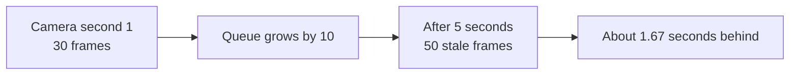
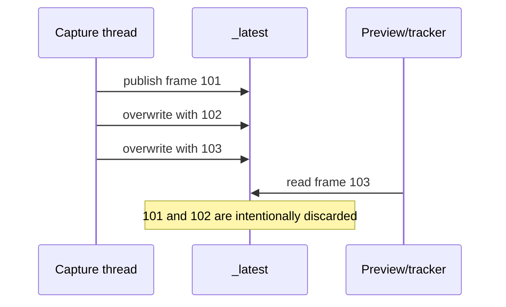

# The single latest-frame slot

> **TL;DR** — The application stores one current frame, not a queue. New frames overwrite unread
> frames so slow consumers see fresh video instead of increasingly old video.

## The queue failure mode

Suppose capture produces 30 FPS and tracking consumes 20 FPS:



The system may process every frame correctly while producing a visibly incorrect live experience.

## The chosen structure



The slot is `_latest: FramePacket | None` at
`src/kardboard_vtuber/camera/stream.py:59`. Publication occurs at `stream.py:198-204`.

## Sequence-number protocol

The consumer remembers its last sequence and asks for something newer:

```python
packet = camera.read(after_sequence=last_sequence, timeout=2.0)
```

The comparison is implemented at `stream.py:126-129`. This avoids processing the same current
frame repeatedly while still allowing the producer to skip arbitrary sequence values from the
consumer's perspective.

## Overwrite metric

Whenever a previous packet exists, publication increments `overwritten_frames`. A rising value is
not automatically a defect. It proves the system is discarding stale intermediate states instead
of buffering them.

## Complexity

- Publish: O(1), excluding rotation/mirroring.
- Stored video memory: one frame.
- Consumer copy: O(pixels) when `copy=True`.
- No queue growth and no queue-drain phase.

## Tradeoff

This structure is wrong for recording, auditing, or offline batch processing where every frame
matters. It is right for interactive pose tracking where old observations have almost no value.

## Test evidence

`test_latest_frame_camera_overwrites_unread_frames()` deliberately lets the producer outrun the
consumer and asserts that overwrites occur (`tests/test_camera_stream.py:67-80`).

---

⬅️ [Algorithm catalogue](README.md) · ➡️
[Condition-variable synchronization](condition-variable-synchronization.md)
