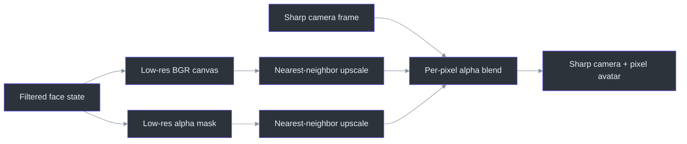
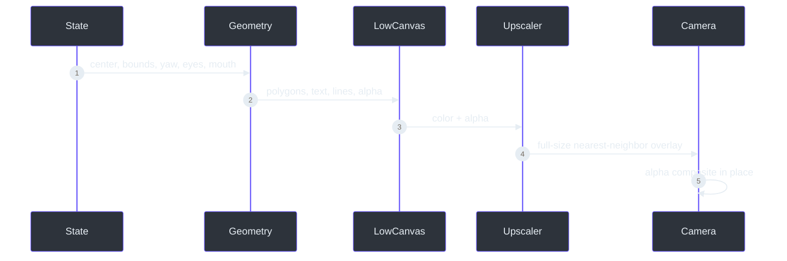

# Low-resolution overlay compositing

> **Status: implemented.**
>
> **TL;DR** — Avatar color and alpha are drawn on a small canvas, enlarged with nearest-neighbor
> interpolation, and blended over the original camera frame. Only the box becomes pixelated
> (`src/kardboard_vtuber/renderer/ps1_cardboard.py:45-165`).

## Algorithm

```text
low_width  = ceil(frame_width  / pixel_scale)
low_height = ceil(frame_height / pixel_scale)
draw avatar color and alpha at low resolution
upscale color and alpha with nearest-neighbor interpolation
output = avatar * alpha + camera * (1 - alpha)
```



## Why two buffers

The color canvas stores cardboard pixels; the alpha mask records coverage. Keeping them separate
allows fully opaque panels, a transparent background, an intentional neck cutout, text-shaped eyes,
and polygon flaps without
pixelating or recoloring the camera outside the avatar
(`src/kardboard_vtuber/renderer/ps1_cardboard.py:51-59`,
`src/kardboard_vtuber/renderer/ps1_cardboard.py:151-165`).

## Geometry mapping

Face center and bounds are converted from normalized state into low-resolution coordinates. Yaw
adds a bounded horizontal skew, while top and side polygons create a coarse pseudo-3D silhouette
(`src/kardboard_vtuber/tracking/models.py:55-80`,
`src/kardboard_vtuber/renderer/ps1_cardboard.py:66-136`).



## Complexity

Low-resolution drawing is O((W/P) × (H/P)), where P is `pixel_scale`. The final resize and blend
are O(W × H), required once per output pixel. Memory is one low-resolution color canvas, one
low-resolution mask, and their temporary full-resolution upscales.

## Validation

The renderer leaves no-face frames unchanged, modifies only the tracked head region, changes flap
pixels with mouth input, maps anatomical eyes to the correct mirrored screen side, preserves the
camera through the bottom neck opening, and keeps the cardboard front fully opaque
(`tests/test_ps1_cardboard_renderer.py:38-106`). Spring behavior is independently covered
(`tests/test_motion_springs.py:18-72`), and CLI composition occurs before diagnostics
(`src/kardboard_vtuber/cli.py:153-167`).

## References

- `src/kardboard_vtuber/renderer/ps1_cardboard.py:45-272`
- `src/kardboard_vtuber/tracking/models.py:55-100`
- `src/kardboard_vtuber/motion/springs.py:26-85`
- `src/kardboard_vtuber/cli.py:153-167`
- `tests/test_ps1_cardboard_renderer.py:1-86`
- `tests/test_motion_springs.py:1-72`

---

⬅️ [Damped spring integration](damped-spring-integration.md) · 🏠
[Algorithms and data structures](README.md)
