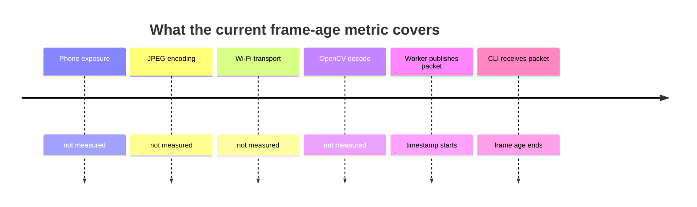

# Monotonic timing and FPS estimation

> **TL;DR** — The subsystem uses monotonic time because durations must not jump when the wall clock
> changes. It measures received FPS over repeated windows of at least one second.

## Two clocks, two jobs

| Clock | Suitable for | Unsuitable for |
|---|---|---|
| Wall clock | Human timestamps and logs | Frame age and timeout math |
| Monotonic clock | Durations, deadlines, FPS | Calendar timestamps |

`FramePacket.captured_at_ns` is assigned with `time.monotonic_ns()` at
`src/kardboard_vtuber/camera/stream.py:197`.

## Frame-age calculation

```text
frame_age_ms = (monotonic_now_ns - captured_at_ns) / 1,000,000
```

The preview computes this at `src/kardboard_vtuber/cli.py:88`.



Therefore a displayed 0.4 ms does not mean the phone-to-screen path is 0.4 ms.

## FPS window

The worker counts published frames. Once at least one second has elapsed:

```text
measured_fps = window_frame_count / elapsed_seconds
window_start = now
window_frame_count = 0
```

Implementation: `stream.py:281-288`.

## Why not trust `CAP_PROP_FPS`?

That property is a negotiated or reported source value. It may be zero, stale, rounded, or simply
different from delivered throughput. The project records both negotiated and measured FPS.

## Timeout algorithm

`read()` computes a monotonic deadline and repeatedly calculates remaining time
(`stream.py:123-141`). This prevents spurious wakeups from extending the requested timeout.

---

⬅️ [Finite-state lifecycle](finite-state-lifecycle.md) · ➡️
[Design principles](../04-design-principles/README.md)
