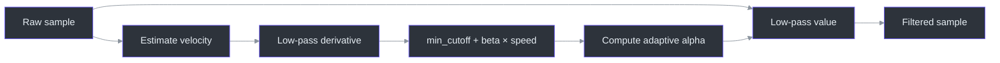
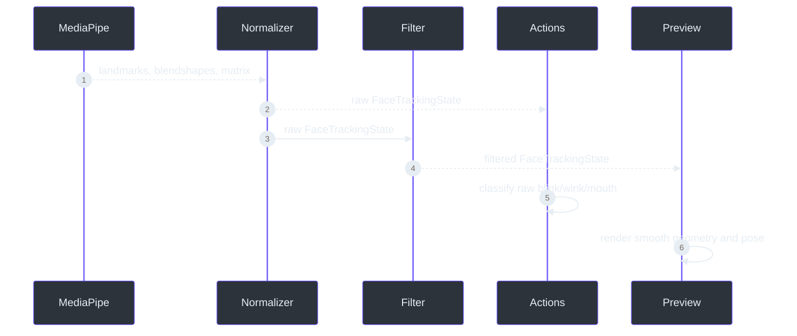

# One Euro motion filtering

> **Status: implemented and offline/live validated.**
>
> **TL;DR** — The One Euro filter lowers cutoff during slow motion to suppress jitter and raises it
> when velocity increases to reduce lag. Raw state remains available for blink/wink classification;
> filtered state drives visual diagnostics and future rendering
> (`src/kardboard_vtuber/tracking/filters.py:16-175`,
> `src/kardboard_vtuber/tracking/mediapipe_tracker.py:88-190`).

## Why fixed smoothing is insufficient

A strong fixed low-pass filter makes a stationary face look stable but delays intentional motion.
A weak filter follows turns quickly but leaves visible landmark shimmer. One Euro filtering adapts
its cutoff from the filtered derivative:

```text
derivative = (value - previous_raw) / delta_time
cutoff = minimum_cutoff + beta * abs(filtered_derivative)
alpha = 1 / (1 + time_constant / delta_time)
filtered = alpha * value + (1 - alpha) * previous_filtered
```

`OneEuroFilter` enforces finite inputs and strictly increasing timestamps so timing defects fail
explicitly (`src/kardboard_vtuber/tracking/filters.py:32-75`).



## Face-level filter bank

`FaceMotionFilter` owns independent filters for all 478 landmark axes, face center/size, three
expression controls, and six pose values. Different parameter groups avoid applying pose-scale
tuning blindly to normalized eye values (`src/kardboard_vtuber/tracking/filters.py:78-168`).

| Signal group | Default tuning | Intent |
|---|---|---|
| Landmarks | cutoff `1.2`, beta `0.02` | Stable mesh geometry |
| Bounds | cutoff `1.0`, beta `0.03` | Stable box placement and scale |
| Expressions | cutoff `3.0`, beta `0.2` | Preserve quick blinks and mouth motion |
| Pose | cutoff `1.0`, beta `0.02` | Reduce rotational shimmer |

Filters reset when the face is lost or landmark count changes. Reacquisition starts directly from
the new observation rather than blending from stale coordinates
(`src/kardboard_vtuber/tracking/filters.py:112-168`,
`tests/test_tracking_filters.py:69-81`).



## Raw and filtered state split

`TrackingSnapshot` exposes both `raw_state` and filtered `state`
(`src/kardboard_vtuber/tracking/models.py:88-100`). The CLI deliberately feeds `raw_state` to
`FaceActionDetector`, preventing smoothing from extending the effective eye debounce or swallowing
normal blinks (`src/kardboard_vtuber/cli.py:130-144`,
`src/kardboard_vtuber/tracking/events.py:84-181`).

Use `--no-motion-filter` to compare raw visual behavior without changing action semantics
(`src/kardboard_vtuber/cli.py:76-81`, `src/kardboard_vtuber/cli.py:219-230`).

## Measured evidence

A ten-second live neutral probe collected 299 detected samples:

| Metric | Raw | Filtered |
|---|---:|---:|
| Center-X standard deviation | `0.002961` | `0.002880` |
| Yaw frame-step standard deviation | `0.110°` | `0.054°` |

The recorded 45-second calibration clip was then replayed through the full pipeline: all 1,254
frames detected a face and emitted bilateral blink, both wink directions, and mouth transitions.
The recording is a private session artifact and is intentionally not committed.

## Complexity

Each scalar update is O(1). Filtering all landmarks is O(L), where L is 478, with O(L) persistent
filter state. This remains bounded because the application tracks exactly one face.

## References

- `src/kardboard_vtuber/tracking/filters.py:1-175`
- `src/kardboard_vtuber/tracking/models.py:55-137`
- `src/kardboard_vtuber/tracking/mediapipe_tracker.py:43-199`
- `src/kardboard_vtuber/tracking/events.py:73-181`
- `src/kardboard_vtuber/cli.py:45-230`
- `tests/test_tracking_filters.py:1-92`

---

⬅️ [Facial action state machine](facial-action-state-machine.md) · 🏠
[Algorithms and data structures](README.md)
