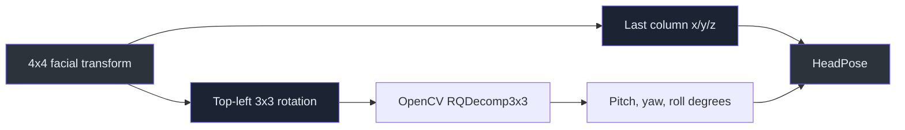
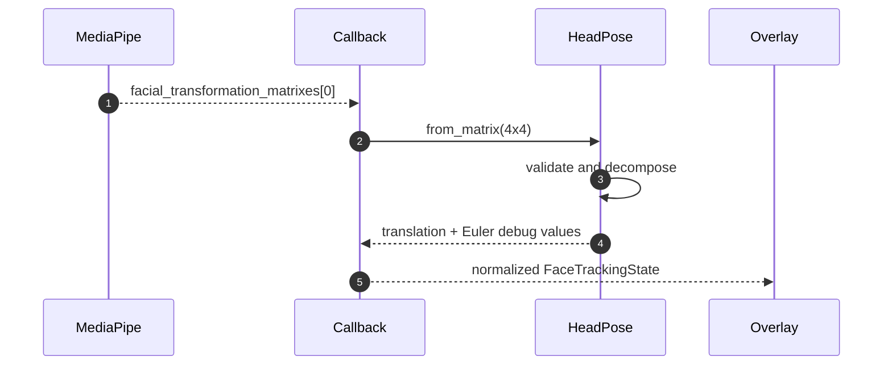

# Facial transformation matrix decomposition

> **TL;DR** — MediaPipe emits a 4x4 transform. The project preserves translation and decomposes the
> rotation block into pitch, yaw, and roll for debugging. Rendering should later retain a matrix or
> quaternion to avoid Euler-angle artifacts.

## Matrix structure

```text
[ r00 r01 r02 tx ]
[ r10 r11 r12 ty ]
[ r20 r21 r22 tz ]
[  0   0   0   1 ]
```

`HeadPose.from_matrix()` validates the exact 4x4 shape
(`src/kardboard_vtuber/tracking/models.py:37-53`).



## Data flow



## Why Euler angles are not the final renderer representation

Euler angles are readable but suffer from axis-order ambiguity and gimbal-lock behavior. The PS1
renderer should smooth a quaternion or rotation matrix, then derive Euler values only for
diagnostics.

## Coordinate caution

The current values are reported in MediaPipe's transform convention. Rotation direction and
translation scale require calibration against the final renderer. Mirroring happens before
tracking (`src/kardboard_vtuber/camera/stream.py:192-197`), so signs must be validated visually.

## Test evidence

- Identity transformation produces zero translation and rotation:
  `tests/test_tracking_models.py:24-33`
- Non-4x4 inputs fail explicitly:
  `tests/test_tracking_models.py:36-38`

## References

- `src/kardboard_vtuber/tracking/models.py:25-53`
- `src/kardboard_vtuber/tracking/mediapipe_tracker.py:143-166`
- `src/kardboard_vtuber/camera/stream.py:192-197`
- `src/kardboard_vtuber/cli.py:207-231`
- `tests/test_tracking_models.py:24-38`

---

⬅️ [Blendshape normalization](blendshape-normalization.md) · 🏠
[Algorithm catalogue](README.md)
