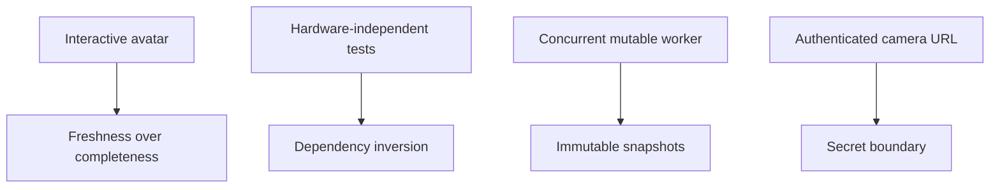

# 04 · Design principles

> **TL;DR** — The implementation is governed by four deliberate principles: freshness over
> completeness, dependency inversion at hardware boundaries, immutable observation of mutable
> runtime state, and explicit security boundaries around camera sources.

## Principle catalogue

| Principle | Chapter | Concrete manifestation |
|---|---|---|
| Latency over completeness | [Latency over completeness](latency-over-completeness.md) | Single latest-frame slot |
| Dependency inversion | [Dependency inversion](dependency-inversion.md) | `VideoCaptureLike` + injected factory |
| Immutable observations | [Immutable snapshots](immutable-snapshots.md) | Frozen `CaptureSnapshot` |
| Security by boundary | [Security and secret boundaries](security-and-secret-boundaries.md) | URL redaction and ignored local config |

These are not slogans added after implementation. Each principle maps to code and tests.

---

⬅️ [Algorithms](../03-algorithms-and-data-structures/README.md) · ➡️
[Camera ingestion](../05-camera-ingestion/README.md)
