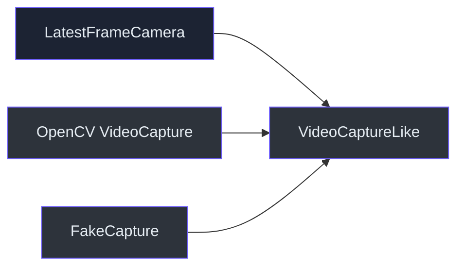
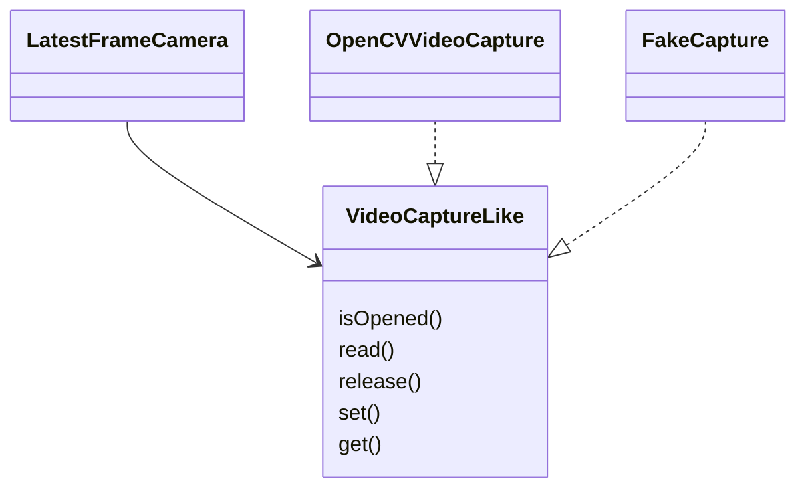

# Design principle: dependency inversion at the capture boundary

> **Rule:** Core lifecycle logic should depend on the behavior it needs, not directly on a physical
> camera or a concrete OpenCV object.

## The boundary

`VideoCaptureLike` declares five methods at
`src/kardboard_vtuber/camera/stream.py:20-29`. Production adapts OpenCV through
`_default_capture_factory()` at `stream.py:35-36`.

Python protocols use structural typing: the adapter does not need to inherit from the protocol. It
only needs compatible methods.

## Benefits

- Tests run without cameras or network access.
- Failure behavior can be simulated deterministically.
- OpenCV remains replaceable without rewriting the worker.
- The core class has a smaller contract than the full `cv2.VideoCapture` API.

## Constructor injection

`LatestFrameCamera.__init__()` accepts `capture_factory`
(`src/kardboard_vtuber/camera/stream.py:47-53`). Tests pass a lambda returning `FakeCapture`
(`tests/test_camera_stream.py:49-53`).

## Tradeoff

The protocol does not guarantee runtime correctness by itself. Tests and type checking verify the
shape, while integration probes verify actual backend behavior.

## Interview explanation

“I inverted the hardware dependency by defining the smallest capture protocol the worker needed
and injecting a factory. That let unit tests exercise concurrency and buffering without flaky
camera hardware.”

---

⬅️ [Latency over completeness](latency-over-completeness.md) · ➡️
[Immutable snapshots](immutable-snapshots.md)
