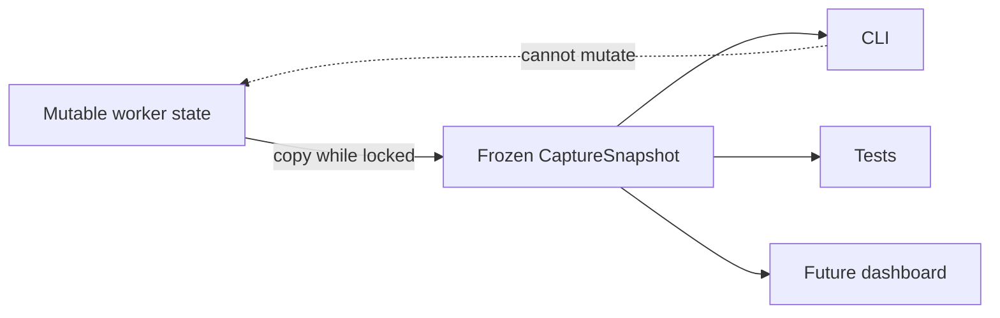

# Design principle: immutable observations of mutable state

> **Rule:** The worker may own mutable runtime state, but readers receive immutable point-in-time
> values rather than references they can change.

## The problem

The capture worker constantly changes counters, state, errors, and negotiated properties. Returning
the internal object would let presentation code accidentally corrupt capture behavior.

`CaptureSnapshot` is a frozen, slotted dataclass at
`src/kardboard_vtuber/camera/models.py:141-157`. `snapshot()` constructs it under the condition lock
at `stream.py:143-158`.

## Benefits

- Readers cannot mutate the worker.
- One snapshot remains internally consistent.
- Presentation logic is decoupled from synchronization details.
- Future JSON serialization or telemetry export has a stable schema.

## Same idea in configuration

`CameraConfig`, `CameraSource`, and `FramePacket` are also frozen. A running camera cannot silently
change configuration halfway through a frame. A future reconfiguration feature should construct a
new config and perform an explicit transition.

## Tradeoff

Snapshots allocate small Python objects. This cost is negligible compared with decoding and copying
video frames, and the clarity is worth it.

---

⬅️ [Dependency inversion](dependency-inversion.md) · ➡️
[Security boundaries](security-and-secret-boundaries.md)
