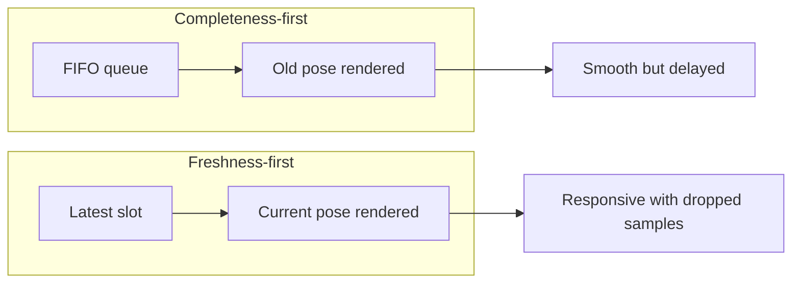

# Design principle: latency over completeness

> **Rule:** In an interactive camera pipeline, process the newest useful observation rather than
> preserving every historical observation.

## Why

Human perception is sensitive to motion lag. A complete but delayed head pose feels worse than a
slightly lower effective frame rate that stays synchronized with the person.

## Code evidence

- `_latest` stores one packet: `src/kardboard_vtuber/camera/stream.py:59`
- New packets overwrite it: `stream.py:198-204`
- Consumers request newer sequence values: `stream.py:114-141`
- Overwrite behavior is tested: `tests/test_camera_stream.py:67-80`

## Limits of the principle

Use this principle for:

- face tracking;
- avatar pose;
- interactive preview;
- telemetry that describes current state.

Do not use it for:

- recordings;
- forensic evidence;
- offline model training;
- exact frame-by-frame export.

## Interview explanation

“I treated frames as a sampled state stream rather than a work queue. That bounded memory to one
frame and prevented unbounded latency when downstream processing became slower than capture.”

---

⬅️ [Principles](README.md) · ➡️ [Dependency inversion](dependency-inversion.md)
