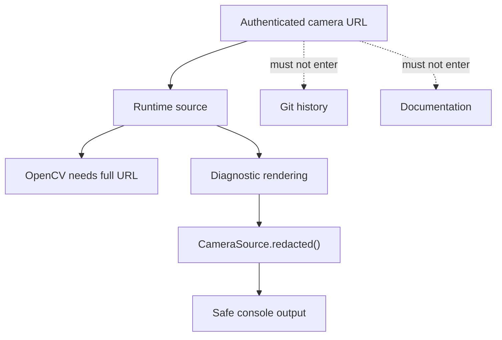

# Design principle: security and secret boundaries

> **Rule:** A camera source may contain credentials, but logs, diagnostics, documentation, tests,
> and commits must not expose real credential values.

## Threat model

## Implemented controls

- `CameraSource.redacted()` replaces user information with `***`
  (`src/kardboard_vtuber/camera/models.py:80-87`).
- Snapshots use the redacted source (`stream.py:143-158`).
- `.env`, local config, logs, captures, and recordings are ignored (`.gitignore:1-35`).
- Documentation uses placeholders rather than actual credentials.

## Important limitation

Passing a full authenticated URL on a command line can expose it in shell history or process
inspection. Redacting application output does not erase that external exposure. A future
configuration subsystem should support local secret storage or interactive credential input.

## Operational rules

1. Use a camera-only password that is not reused elsewhere.
2. Do not commit the URL.
3. Prefer a private tethered network where practical.
4. Disable the server when not streaming.
5. Rotate credentials if they appear in screenshots or shared logs.

## Test evidence

Credential redaction is verified by
`test_camera_source_redacts_credentials()` at `tests/test_camera_models.py:20-24` using synthetic
credentials only.

---

⬅️ [Immutable snapshots](immutable-snapshots.md) · ➡️
[Camera ingestion](../05-camera-ingestion/README.md)
