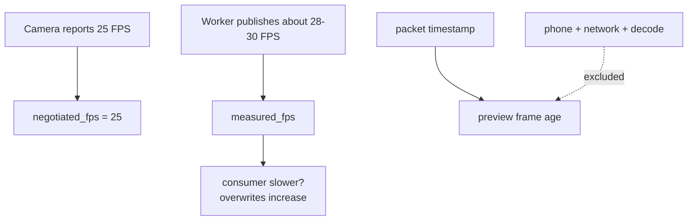

# Diagnostics and performance interpretation

> **TL;DR** — Diagnostics distinguish what the source claims, what the worker actually receives,
> and how quickly the current packet reaches the preview after decode.

## Snapshot fields

| Field | Meaning |
|---|---|
| `state` | Current lifecycle |
| `source` | Redacted source |
| `backend` | Selected OpenCV backend |
| `negotiated_*` | Values reported by the opened source |
| `measured_fps` | Frames published per measured time window |
| `received_frames` | Total successful publications |
| `overwritten_frames` | Frames superseded in the latest slot |
| `read_failures` | Individual failed reads |
| `reconnects` | Source reopen attempts |
| `last_error` | Most recent open/read/worker error |

Construction: `src/kardboard_vtuber/camera/stream.py:143-158`.

## Metrics relationship

## Interpreting overwrites

High overwrites with stable measured FPS are expected when the consumer asks only for the newest
frame. Investigate only if visible motion is poor or a consumer was expected to inspect every
frame.

## Development-machine baselines

| Source/backend | Result |
|---|---|
| Integrated camera, `auto` | 640x480 at approximately 30 FPS |
| Integrated camera, `dshow` | Approximately 12 FPS |
| Integrated camera, `msmf` | Opened but did not continuously deliver in short probe |
| Phone MJPEG, `auto`, after restart | 1080x1920 final portrait at approximately 28-30 FPS |

Baselines are observations, not portable guarantees.

## Benchmark protocol

1. Record source settings and backend.
2. Warm up for several seconds.
3. Record negotiated resolution/FPS.
4. Record measured FPS for at least 30 seconds.
5. Record read failures and reconnects.
6. Observe end-to-end motion delay separately from internal frame age.
7. Repeat after restart before concluding a transport limit.

---

⬅️ [Android IP Webcam](android-ip-webcam.md) · 🏠 [Camera chapter](README.md)
