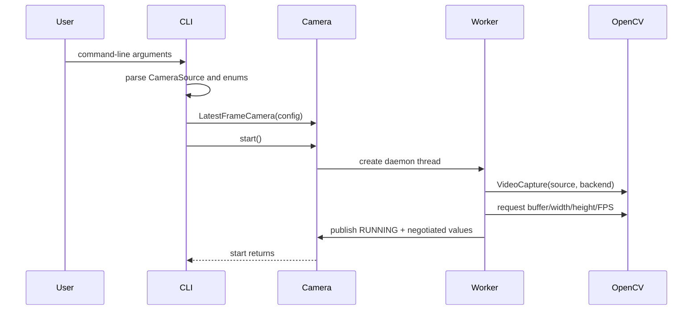
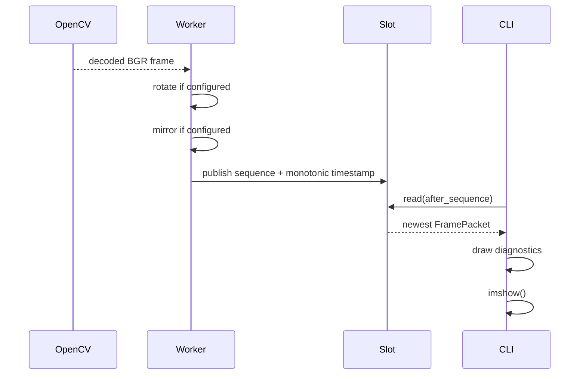
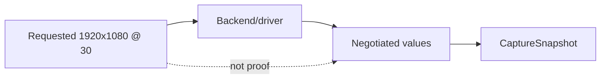

# Camera runtime flow

> **TL;DR** — The CLI constructs immutable configuration, starts the worker, waits for newer
> packets, renders diagnostics, and shuts down cleanly. Reconnection remains inside the camera
> class rather than leaking into the UI loop.

## Startup sequence

CLI construction: `src/kardboard_vtuber/cli.py:54-70`.

## Per-frame sequence

Transformation order is rotation followed by mirroring
(`src/kardboard_vtuber/camera/stream.py:192-197`). Mirroring after rotation means “horizontal” is
relative to the final displayed orientation.

## Requested versus negotiated properties

`_apply_requests()` asks the backend for buffer size, width, height, and FPS
(`stream.py:261-268`). `_open()` then reads actual values back (`stream.py:246-248`).

## Shutdown sequence

The CLI exits on duration, `Q`, Escape, Ctrl+C, or terminal error. Its `finally` block always calls
`camera.stop()` and `cv2.destroyAllWindows()` (`src/kardboard_vtuber/cli.py:115-126`).

---

⬅️ [Camera chapter](README.md) · ➡️ [Android IP Webcam](android-ip-webcam.md)
