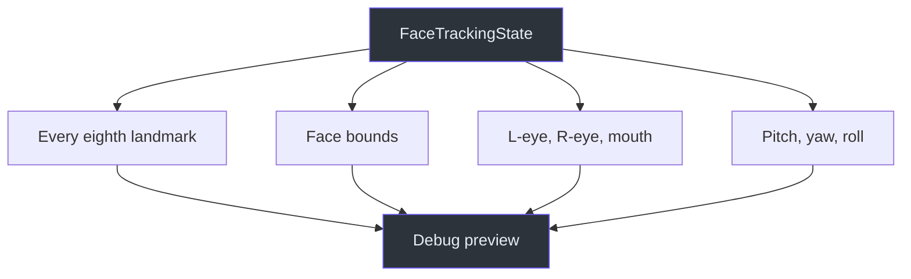
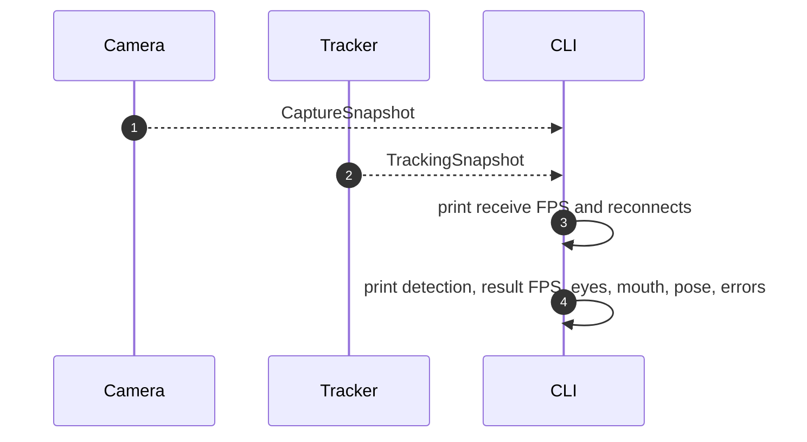

# Live tracking debugging and validation

> **TL;DR** — A tracker is not proven by “face detected.” The preview exposes landmarks, bounds,
> eye values, mouth value, pose, throughput, submitted/results counts, and callback errors.

## Visual overlay

`draw_tracking_debug()` renders every eighth landmark, a face bounding box, independent eye
openness, mouth openness, and pitch/yaw/roll
(`src/kardboard_vtuber/tracking/mediapipe_tracker.py:177-232`).

## Console diagnostics

Every reporting interval, the CLI prints camera and tracker snapshots
(`src/kardboard_vtuber/cli.py:101-105`, `src/kardboard_vtuber/cli.py:207-231`).

## Manual validation script

1. Hold neutral expression and verify both eyes are near open.
2. Close only the left eye and verify one value falls.
3. Close only the right eye and verify the other value falls.
4. Open and close the mouth and verify `mouth` changes.
5. Rotate and tilt the head and verify pose signs change consistently.
6. Move closer/farther and verify bounds change.
7. Leave frame and verify `detected=False`.
8. Return and verify recovery without restarting.

## Verified first probe

The twelve-second headless phone test used the same rotated and mirrored 1080p stream as the camera
milestone. Camera and tracker both remained around 30 FPS, face detection stayed active, one result
was normally in flight, and no callback error was reported.

## Measurement cautions

- Tracking FPS is callback throughput, not model-only inference time.
- `submitted - results` combines current in-flight and inputs MediaPipe may drop.
- Eye openness is derived from blendshapes and still needs user calibration.
- Euler angles are a debug view; the future renderer should preserve quaternion/matrix rotation.

## References

- `src/kardboard_vtuber/cli.py:1`
- `src/kardboard_vtuber/tracking/mediapipe_tracker.py:44-232`
- `src/kardboard_vtuber/tracking/models.py:58-90`
- `src/kardboard_vtuber/camera/stream.py:114-141`
- `tests/test_tracking_models.py:1`

---

⬅️ [Normalized state](normalized-face-state.md) · 🏠 [Face tracking](README.md)
