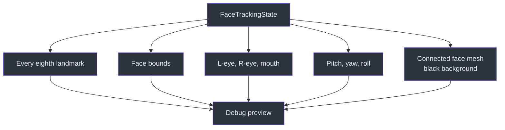
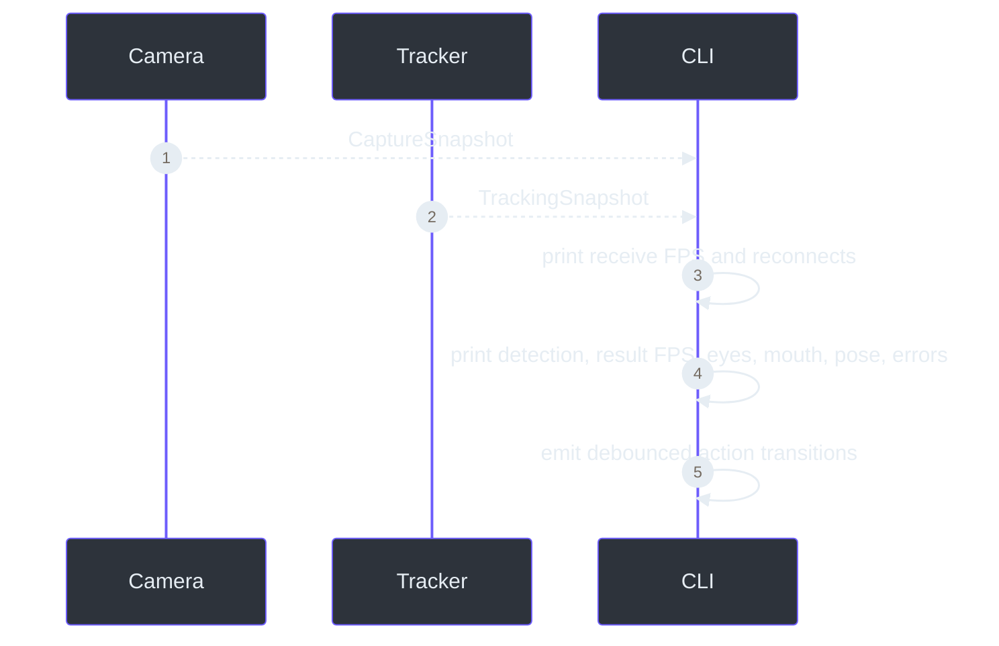

# Live tracking debugging and validation

> **TL;DR** — A tracker is not proven by “face detected.” The preview exposes landmarks, bounds,
> a connected top-right face mesh, eye values, mouth value, pose, throughput, action transitions,
> submitted/results counts, and callback errors.

## Visual overlay

`draw_tracking_debug()` renders every eighth landmark, a face bounding box, independent eye
openness, mouth openness, pitch/yaw/roll, and a black face-mesh inset in the top-right corner
(`src/kardboard_vtuber/tracking/mediapipe_tracker.py:191-328`).

### Face-mesh inset

The inset first converts normalized X/Y deltas back into source-frame pixel proportions, then
recenters and scales them to fit a bounded top-right panel. The pixel conversion is essential for
portrait video: applying one scale directly to normalized coordinates makes the face appear
artificially wide and squashed. The corrected projection preserves the taller face and jaw contour.
It connects the face oval, both eyes, both eyebrows, outer and inner lips, and nose paths, then adds
sparse landmark points for additional motion feedback
(`src/kardboard_vtuber/tracking/mediapipe_tracker.py:250-331`,
`tests/test_tracking_models.py:132-171`).

The black background intentionally removes camera texture from this diagnostic region. That makes
landmark motion, eye closure, mouth movement, and tracking loss easier to inspect. The inset shows
`NO FACE` when no valid landmark set is available
(`src/kardboard_vtuber/tracking/mediapipe_tracker.py:262-283`).

## Console diagnostics

Every reporting interval, the CLI prints camera and tracker snapshots
(`src/kardboard_vtuber/cli.py:130-146`, `src/kardboard_vtuber/cli.py:218-243`).
Action messages are separate, transition-only logs generated by `FaceActionDetector`
(`src/kardboard_vtuber/cli.py:122-128`,
`src/kardboard_vtuber/tracking/events.py:73-171`).

## Manual validation script

1. Hold neutral expression and verify both eyes are near open.
2. Close only the left eye and verify one value falls.
3. Close only the right eye and verify the other value falls.
4. Open and close the mouth and verify `mouth` changes.
5. Rotate and tilt the head and verify pose signs change consistently.
6. Move closer/farther and verify bounds change.
7. Leave frame and verify `detected=False`.
8. Return and verify recovery without restarting.
9. Confirm the top-right mesh follows the face and remains legible against its black background.
10. Repeat the eye tests with spectacles and watch for reflection-induced false closures.

## Verified first probe

The latest twelve-second headless phone test used the same rotated and mirrored 1080p stream as the
camera milestone. Camera and tracker remained around 30 FPS, face detection stayed active, one
result was normally in flight, and no callback error was reported. With spectacles visible, the
action detector emitted face detection, eyes closed, blink, and eyes open transitions. The inset's
pixel-level rendering is covered by an automated test, but its final placement still requires the
user-visible preview rather than a headless probe
(`tests/test_tracking_models.py:114-131`).

## Completed expression and pose calibration

The guided live calibration was performed while the user wore spectacles:

| Control | Observed evidence | Result |
|---|---|---|
| Left wink | Repeated events with the winked eye around `0.43-0.60` | Passed |
| Right wink | Event at left `0.75`, right `0.43` | Passed |
| Mouth open | Repeated events around `0.65-0.73` | Passed |
| Mouth closed | Repeated events around `0.02-0.04` | Passed |
| Yaw | Approximately `-48.8` to `+31.2` degrees | Responsive |
| Pitch | Approximately `-46.1` to `+4.1` degrees | Responsive |
| Roll | Approximately `-13.9` to `+12.6` degrees | Responsive |
| Throughput | Generally near 30 camera and tracking FPS | Passed |

Very large head turns or tilts briefly produced `face_lost`, followed by automatic recovery. This
is expected when eyes and central facial features become too oblique or leave the useful camera
view; smoothing cannot reconstruct a genuinely missing observation.

## Measurement cautions

- Tracking FPS is callback throughput, not model-only inference time.
- `submitted - results` combines current in-flight and inputs MediaPipe may drop.
- Eye openness is derived from blendshapes and still needs user calibration.
- Lens glare or thick frames can reduce eye/blink accuracy even when face detection remains stable.
- Wink classification therefore combines an open-eye requirement with a minimum left/right
  difference instead of requiring the winked eye to reach the bilateral closed threshold.
- Euler angles are a debug view; the future renderer should preserve quaternion/matrix rotation.

## References

- `src/kardboard_vtuber/cli.py:1`
- `src/kardboard_vtuber/tracking/mediapipe_tracker.py:44-232`
- `src/kardboard_vtuber/tracking/models.py:58-90`
- `src/kardboard_vtuber/tracking/events.py:1-171`
- `src/kardboard_vtuber/camera/stream.py:114-141`
- `tests/test_tracking_events.py:1-102`
- `tests/test_tracking_models.py:1`

---

⬅️ [Normalized state](normalized-face-state.md) · 🏠 [Face tracking](README.md)
