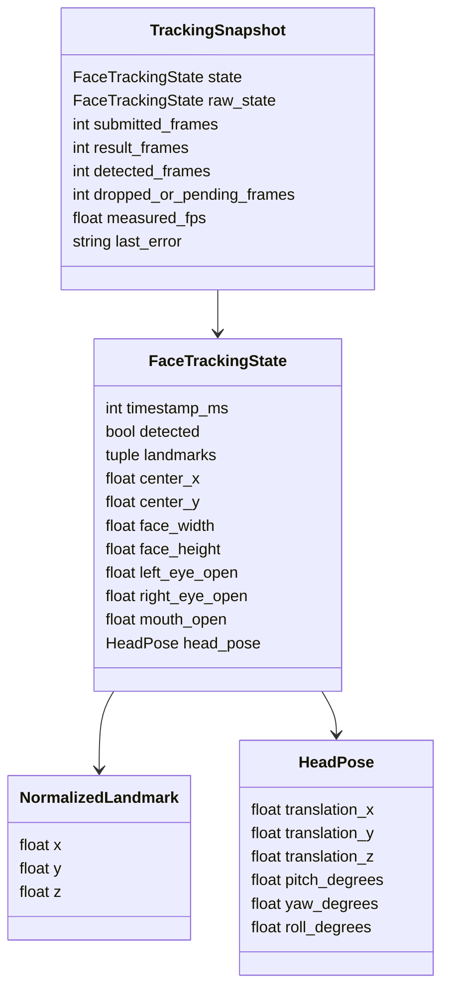
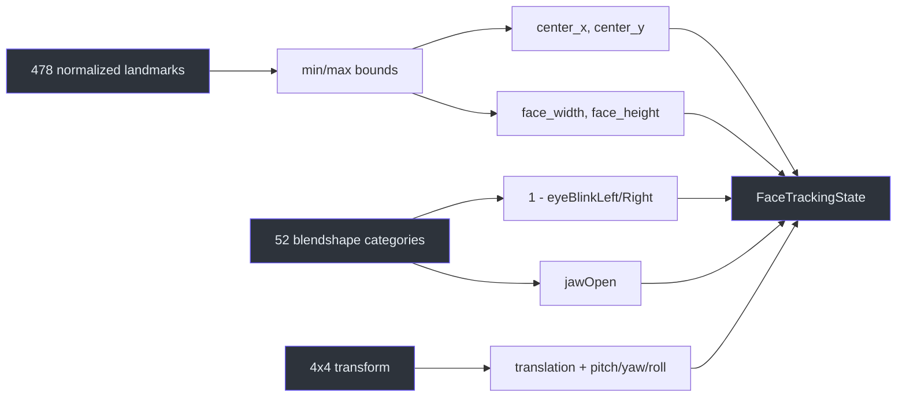

# Normalized face state

> **TL;DR** — `FaceTrackingState` is the anti-corruption layer between MediaPipe and the current
> renderer. It preserves only stable concepts the application owns.

## Contract shape



Definitions live in `src/kardboard_vtuber/tracking/models.py:15-90`.

## Data derivation



`normalize_face()` performs this conversion
(`src/kardboard_vtuber/tracking/models.py:93-135`).

## Invariants

- Eye and mouth controls are clamped to `[0, 1]`
  (`src/kardboard_vtuber/tracking/models.py:148-151`).
- Non-finite blendshape scores become zero.
- No-face observations use centered neutral defaults
  (`src/kardboard_vtuber/tracking/models.py:74-88`).
- All contracts are frozen and slotted.
- The result timestamp uses MediaPipe's millisecond timeline.

## Why retain landmarks?

The opt-in debug overlay uses landmarks as spatial evidence. Current renderers use normalized
bounds, center, expressions, and pose rather than consuming MediaPipe objects directly.

## Raw and filtered states

`TrackingSnapshot` retains the raw normalized observation and the filtered renderer/debug state:

```text
FaceTrackingState (raw normalized observation)
    -> One Euro filter
    -> FaceTrackingState (stable control targets)
    -> AvatarControlState (renderer-specific values)
```

Action detection consumes `raw_state`; visual geometry and current renderer controls consume
filtered `state`. This prevents quick blinks from being hidden by smoothing.

## References

- `src/kardboard_vtuber/tracking/models.py:15-151`
- `src/kardboard_vtuber/tracking/mediapipe_tracker.py:143-166`
- `src/kardboard_vtuber/tracking/mediapipe_tracker.py:177-232`
- `src/kardboard_vtuber/cli.py:1`
- `tests/test_tracking_models.py:1`

---

⬅️ [Face tracking](README.md) · ➡️
[Live debugging](live-debugging-and-validation.md)
