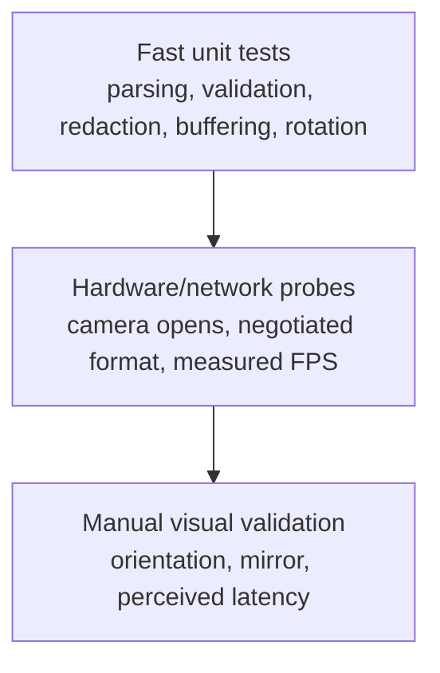
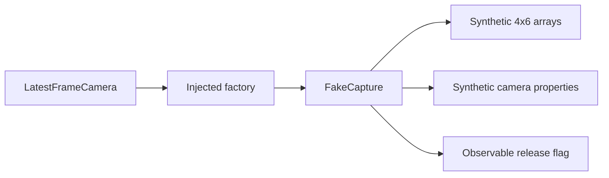

# 07 · Quality and testing

> **Status: camera tests implemented and passing.**
>
> **TL;DR** — The project separates deterministic unit tests from hardware integration checks.
> `FakeCapture` proves buffering and transformation behavior without a camera; real probes verify
> backend and device behavior that mocks cannot establish.

## Test pyramid



## Unit-test inventory

| Test | Purpose | Source |
|---|---|---|
| Device-index parsing | `"2"` becomes integer `2` | `tests/test_camera_models.py:6-10` |
| URL preservation | Stream URL remains a string | `tests/test_camera_models.py:13-17` |
| Credential redaction | User info is hidden | `tests/test_camera_models.py:20-24` |
| Empty-source rejection | Invalid input fails early | `tests/test_camera_models.py:27-30` |
| Dimension validation | Non-positive request rejected | `tests/test_camera_models.py:32-34` |
| Newer sequences | Consumer receives increasing sequence | `tests/test_camera_stream.py:47-64` |
| Frame overwrite | Producer can supersede unread frame | `tests/test_camera_stream.py:67-80` |
| Left rotation | Width/height swap correctly | `tests/test_camera_stream.py:83-98` |
| Identity head pose | Matrix decomposition has neutral output | `tests/test_tracking_models.py:25-33` |
| Matrix validation | Non-4x4 pose input fails explicitly | `tests/test_tracking_models.py:36-38` |
| Face normalization | Bounds, independent eyes, and mouth values | `tests/test_tracking_models.py:41-66` |
| No-face normalization | Neutral fallback has no landmarks | `tests/test_tracking_models.py:69-79` |
| Blendshape clamping | Invalid and out-of-range values are bounded | `tests/test_tracking_models.py:82-101` |
| Debug rendering | Overlay changes a blank frame | `tests/test_tracking_models.py:104-122` |

Pytest reports fifteen tests because the empty-source test is parameterized with two inputs.

## `FakeCapture`

`FakeCapture` at `tests/test_camera_stream.py:13-44` implements the same structural protocol used by
production:



The fake sleeps briefly per read so the real worker thread can publish multiple frames.

## What unit tests cannot prove

- Whether a Windows driver honors requested resolution.
- Whether FFmpeg can decode a particular phone stream.
- True network latency.
- Visual orientation and mirror preference.
- OBS capture behavior.

Those require integration or manual validation.

## Verified commands

```powershell
.\.venv\Scripts\python.exe -m ruff check .
.\.venv\Scripts\python.exe -m pytest
.\.venv\Scripts\python.exe -m kardboard_vtuber --help
```

Current verified result: Ruff passes and all fifteen tests pass in both the Python 3.12 tracking
environment and Python 3.13 base environment.

## Definition of done for a new behavior

1. Model/config contract updated.
2. Runtime behavior wired.
3. CLI or API surface updated where applicable.
4. Deterministic test added.
5. Matching book chapter updated.
6. Ruff and pytest pass.
7. Hardware behavior checked if the change touches a real backend.

---

⬅️ [Face tracking](../06-face-tracking/README.md) · ➡️
[Roadmap](../08-roadmap/README.md)
