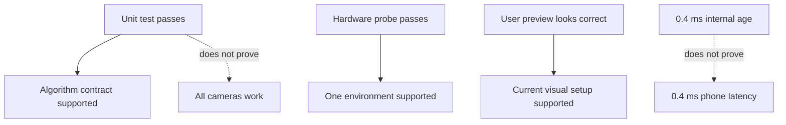
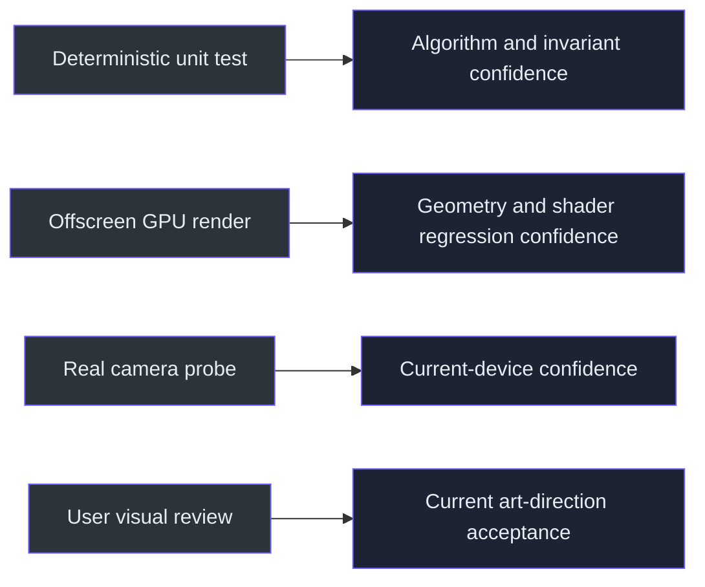

# Validation evidence and known limits

> **TL;DR** — Validation evidence is recorded with scope. A passing fake-capture test proves
> algorithm behavior; a five-second device probe proves only that device/backend combination at
> that moment.

## Evidence matrix

| Claim | Evidence | Confidence |
|---|---|---|
| Source parsing works | Unit tests | High |
| Credentials are redacted in diagnostics | Unit test + runtime output | High |
| Latest-frame overwrite occurs | Threaded fake test | High |
| Left rotation swaps dimensions | Unit test | High |
| Integrated camera works with `auto` | Runtime probe | Machine-specific |
| Phone `/video` works | Authenticated runtime probe | Current phone/network |
| Final portrait is upright | Temporary frame inspection + user preview | High for current placement |
| Phone preview is about 28-30 FPS | Runtime output and user screenshot | Current setup |
| Textured shell has six coherent sides and complete front | Geometry and render regression tests | High |
| Five flap hinges respond independently | Spring and renderer tests | High |
| Green screen hides the room before a fresh mask | Unit tests + recorded-frame validation | High |
| Tracking diagnostics are hidden by default | CLI tests | High |
| Positive box depth is not artificially capped | CLI and renderer tests | High |
| End-to-end latency is sub-millisecond | **Not established** | Do not claim |

## Why evidence scope matters

## Current gaps

- No long-duration soak test.
- No automated reconnect test with a failure-scripted fake.
- No end-to-end latency measurement using a visible timer or LED method.
- No CI workflow yet.
- No long-duration MediaPipe soak test yet.
- No committed pixel-for-pixel golden images; renderer assertions inspect geometry, masks, atlas
  regions, pixels, and measured motion instead.

## Recommended next quality work

1. Add scripted read failures and assert reconnect transitions.
2. Add tests for right and 180-degree rotations plus rotate-then-mirror ordering.
3. Add a 30-minute phone-stream soak tool.
4. Add Markdown link and Mermaid validation.
5. Add CI for Ruff, pytest, and documentation checks.

## Current automated coverage

The latest validated suite contains 108 tests spanning camera contracts and lifecycle, face-state
normalization and actions, One Euro filtering, spring integration, procedural and textured
renderers, full-body rendering, hand occlusion, green-screen fail-closed behavior, and CLI option
validation (`tests/`).

---

⬅️ [Quality chapter](README.md) · 🏠 [Book home](../README.md)
