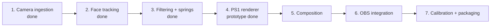
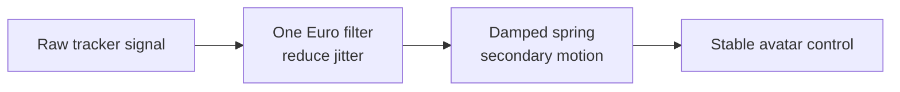
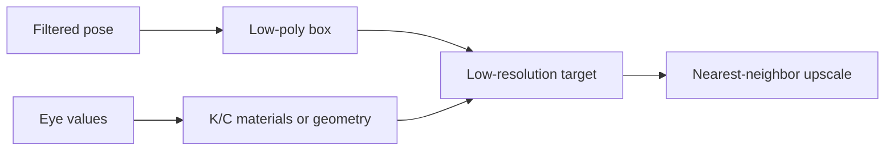

# 08 · Roadmap: from tracking to rendered VTuber

> **TL;DR** — Camera ingestion, tracking, calibration, One Euro filtering, and spring dynamics are
> complete. The next vertical slice is the low-resolution cardboard renderer, followed by
> composition and OBS hardening.

## Delivery sequence

## Milestone 2 · Face tracking — complete

Implemented responsibilities:

- Use MediaPipe Face Landmarker with one face.
- Process a downscaled latest frame asynchronously.
- Produce a library-neutral `NormalizedFaceState`.
- Extract head pose, left/right eye openness, and mouth openness.
- Emit live debug landmarks and diagnostics.

Personal expression calibration is complete. Tracking runs in `.venv312` because the optional
dependency remains restricted below Python 3.13
(`pyproject.toml:21-23`).

## Milestone 3 · Filtering and motion — complete

Implemented signal groups use separate tuning:

- Head translation and rotation.
- Left `K` eye.
- Right `C` eye.
- Mouth/front flaps — deferred for later visual redesign.
- Side-flap secondary motion.

One Euro filtering is wired into tracking. Damped spring dynamics are implemented and tested for
renderer use. See [One Euro motion filtering](../03-algorithms-and-data-structures/one-euro-filtering.md)
and [Damped spring integration](../03-algorithms-and-data-structures/damped-spring-integration.md).

## Milestone 4 · PS1 renderer — prototype complete

The prototype now:

- models a procedural cardboard box with front, top, and side planes;
- renders the avatar at quarter linear resolution;
- uses nearest-neighbor upscale and separate alpha compositing;
- drives anatomical K/C eyes;
- uses a spring for side-plane secondary motion;
- forms an opaque hollow shell with a central bottom neck opening and visible interior rim.

Texture art, ordered dithering, vertex snapping, and a more recognizable production mesh remain
future renderer-polish work.

## Milestone 5 · Composition

The high-resolution camera frame remains sharp. Only the box is pixelated. A tracked mask or
depth-order approximation may later be required around hair, hands, or headphones.

## Milestone 6 · OBS

Start with Window Capture because it is simple and already matches the working preview. Consider
Spout2 only after rendering is stable and transparent box-only output provides real value.

## Acceptance gates

| Milestone | Gate |
|---|---|
| Tracking | Stable pose and independent eyes/mouth on recorded test clips |
| Filtering | Low jitter without visible lag |
| Renderer | Recognizable KardboardCode identity at target frame rate |
| Composition | Correct placement during translation and rotation |
| OBS | Stable capture at intended stream resolution |

---

⬅️ [Quality and testing](../07-quality-and-testing/README.md) · ➡️
[Appendix](../99-appendix/README.md)
