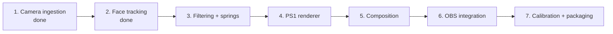
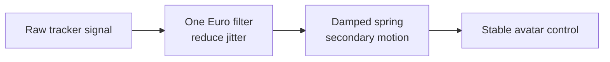
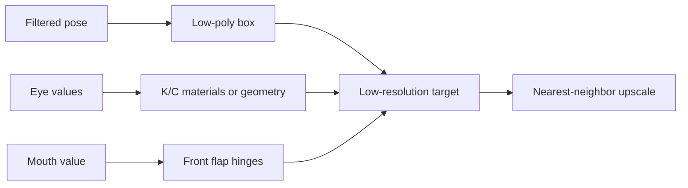

# 08 · Roadmap: from tracking to rendered VTuber

> **TL;DR** — Camera ingestion and raw face tracking are complete. The next vertical slice is
> filtered control signals, followed by a low-resolution cardboard renderer, composition, and OBS
> hardening.

## Delivery sequence

## Milestone 2 · Face tracking — complete

Implemented responsibilities:

- Use MediaPipe Face Landmarker with one face.
- Process a downscaled latest frame asynchronously.
- Produce a library-neutral `NormalizedFaceState`.
- Extract head pose, left/right eye openness, and mouth openness.
- Emit live debug landmarks and diagnostics.

Still pending within the next filtering milestone: neutral-pose and personal expression calibration.
Tracking runs in `.venv312` because the optional dependency remains restricted below Python 3.13
(`pyproject.toml:21-23`).

## Milestone 3 · Filtering and motion

Separate signals will require different tuning:

- Head translation and rotation.
- Left `K` eye.
- Right `C` eye.
- Mouth/front flaps.
- Side-flap secondary motion.

## Milestone 4 · PS1 renderer

The renderer should:

- model a cardboard box with a small number of planes;
- use low-resolution cardboard textures;
- render at 320x180 or 426x240 initially;
- disable anti-aliasing;
- use nearest-neighbor upscale;
- support quantized colors and ordered dithering;
- optionally add controlled vertex snapping/jitter.

## Milestone 5 · Composition

The high-resolution camera frame remains sharp. Only the box is pixelated. A tracked mask or
depth-order approximation may later be required around hair, hands, or headphones.

## Milestone 6 · OBS

Start with Window Capture because it is simple and already matches the working preview. Consider
Spout2 only after rendering is stable and transparent box-only output provides real value.

## Acceptance gates

| Milestone | Gate |
|---|---|
| Tracking | Stable pose and independent eyes/mouth on recorded test clips |
| Filtering | Low jitter without visible lag |
| Renderer | Recognizable KardboardCode identity at target frame rate |
| Composition | Correct placement during translation and rotation |
| OBS | Stable capture at intended stream resolution |

---

⬅️ [Quality and testing](../07-quality-and-testing/README.md) · ➡️
[Appendix](../99-appendix/README.md)
