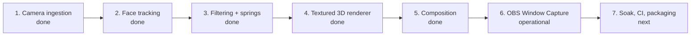
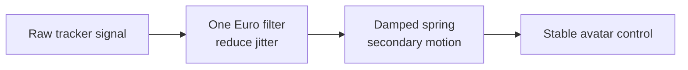
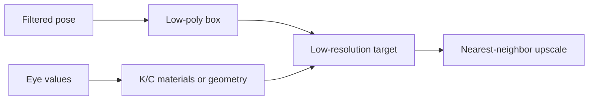

# 08 · Roadmap: from working avatar to production hardening

> **TL;DR** — Camera ingestion, tracking, calibration, One Euro filtering, and spring dynamics are
> complete. The textured renderer, five-hinge physics, body mode, hand occlusion, and green-screen
> output are implemented. The remaining work is reliability, packaging, and optional transport.

## Delivery sequence

## Milestone 2 · Face tracking — complete

Implemented responsibilities:

- Use MediaPipe Face Landmarker with one face.
- Process a downscaled latest frame asynchronously.
- Produce a library-neutral `NormalizedFaceState`.
- Extract head pose, left/right eye openness, and mouth openness.
- Emit live debug landmarks and diagnostics.

Personal expression calibration is complete. Tracking runs in `.venv312` because the optional
dependency remains restricted below Python 3.13
(`pyproject.toml:21-23`).

## Milestone 3 · Filtering and motion — complete

Implemented signal groups use separate tuning:

- Head translation and rotation.
- Left `K` eye.
- Right `C` eye.
- Mouth signal and action events; mouth-art motion remains deferred.
- Three underside hinges and two highly yaw-sensitive external side tabs.

One Euro filtering is wired into tracking. Damped springs drive five renderer hinges. See
[One Euro motion filtering](../03-algorithms-and-data-structures/one-euro-filtering.md)
and [Damped spring integration](../03-algorithms-and-data-structures/damped-spring-integration.md).

## Milestone 4 · PS1 renderer — complete

The default renderer now:

- uses ModernGL and the Windows GPU for real depth-tested 3D rendering;
- generates a complete-front cubic box, neck-safe underside, flaps, corrugated edge layers,
  earcups, cushions, and headband;
- drives calibrated pitch/yaw/roll and anatomical K/C wink states;
- renders a transparent low-resolution framebuffer and composites it over the sharp camera;
- preserves black-before-acquisition and last-safe-frame tracking-loss behavior;
- includes aged asymmetric shipping labels, barcodes, package IDs, arrows, and top `FRAGILE`;
- exposes configurable perspective depth and five optional spring hinges;
- falls back to the procedural renderer if OpenGL initialization fails.

The current design is the accepted visual baseline. Future art changes should preserve its privacy
volume, complete front face, neck channel, atlas assignments, and hinge identities.

## Milestone 5 · Composition — complete

The high-resolution camera frame remains sharp while the avatar stays pixelated. Full-body pose
appears only in a separate line-skeleton diagnostic window, hand/forearm masking can restore a
bounded foreground, and person segmentation can replace the room with chroma green.

## Milestone 6 · OBS — operational

Window Capture consumes the clean preview today. `--green-screen` provides a straightforward OBS
chroma-key workflow. Spout2 remains optional rather than required.

## Remaining work

1. Add CI for Ruff, pytest, Markdown links, and Mermaid parsing.
2. Run long camera, tracking, segmentation, and OBS soak tests.
3. Package verified model-download and first-run setup.
4. Measure true end-to-end latency with an external visual clock.
5. Consider Spout2 only if Window Capture and chroma key become limiting.

## Acceptance gates

| Milestone | Gate |
|---|---|
| Tracking | Stable pose and independent eyes/mouth on recorded test clips |
| Filtering | Low jitter without visible lag |
| Renderer | Recognizable KardboardCode identity at target frame rate |
| Composition | Correct placement during translation and rotation |
| OBS | Stable capture at intended stream resolution |

---

⬅️ [Quality and testing](../07-quality-and-testing/README.md) · ➡️
[Appendix](../99-appendix/README.md)
