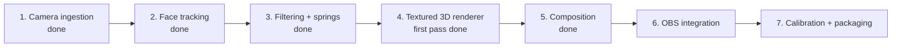
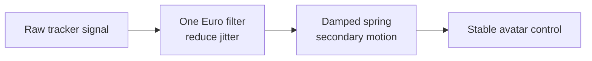
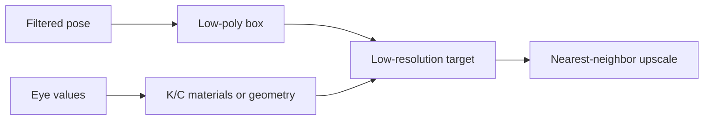

# 08 · Roadmap: from tracking to rendered VTuber

> **TL;DR** — Camera ingestion, tracking, calibration, One Euro filtering, and spring dynamics are
> complete. The first textured GPU 3D renderer is implemented. The next phase is art refinement
> against the canonical target, followed by OBS hardening.

## Delivery sequence

## Milestone 2 · Face tracking — complete

Implemented responsibilities:

- Use MediaPipe Face Landmarker with one face.
- Process a downscaled latest frame asynchronously.
- Produce a library-neutral `NormalizedFaceState`.
- Extract head pose, left/right eye openness, and mouth openness.
- Emit live debug landmarks and diagnostics.

Personal expression calibration is complete. Tracking runs in `.venv312` because the optional
dependency remains restricted below Python 3.13
(`pyproject.toml:21-23`).

## Milestone 3 · Filtering and motion — complete

Implemented signal groups use separate tuning:

- Head translation and rotation.
- Left `K` eye.
- Right `C` eye.
- Mouth/front flaps — deferred for later visual redesign.
- Side-flap secondary motion.

One Euro filtering is wired into tracking. Damped spring dynamics are implemented and tested for
renderer use. See [One Euro motion filtering](../03-algorithms-and-data-structures/one-euro-filtering.md)
and [Damped spring integration](../03-algorithms-and-data-structures/damped-spring-integration.md).

## Milestone 4 · PS1 renderer — textured 3D first pass complete

The default renderer now:

- uses ModernGL and the Windows GPU for real depth-tested 3D rendering;
- generates a textured box, flaps, corrugated edge layers, earcups, cushions, and headband;
- drives calibrated pitch/yaw/roll and anatomical K/C wink states;
- renders a transparent low-resolution framebuffer and composites it over the sharp camera;
- preserves black-before-acquisition and last-safe-frame tracking-loss behavior;
- falls back to the procedural renderer if OpenGL initialization fails.

The first pass is substantially closer to the canonical target, but production art refinement,
better flap articulation, richer headphone geometry, vertex snapping, and scene-aware lighting
remain.

## Milestone 5 · Composition

The high-resolution camera frame remains sharp. Only the box is pixelated. A tracked mask or
depth-order approximation may later be required around hair, hands, or headphones.

## Milestone 6 · OBS

Start with Window Capture because it is simple and already matches the working preview. Consider
Spout2 only after rendering is stable and transparent box-only output provides real value.

## Acceptance gates

| Milestone | Gate |
|---|---|
| Tracking | Stable pose and independent eyes/mouth on recorded test clips |
| Filtering | Low jitter without visible lag |
| Renderer | Recognizable KardboardCode identity at target frame rate |
| Composition | Correct placement during translation and rotation |
| OBS | Stable capture at intended stream resolution |

---

⬅️ [Quality and testing](../07-quality-and-testing/README.md) · ➡️
[Appendix](../99-appendix/README.md)
