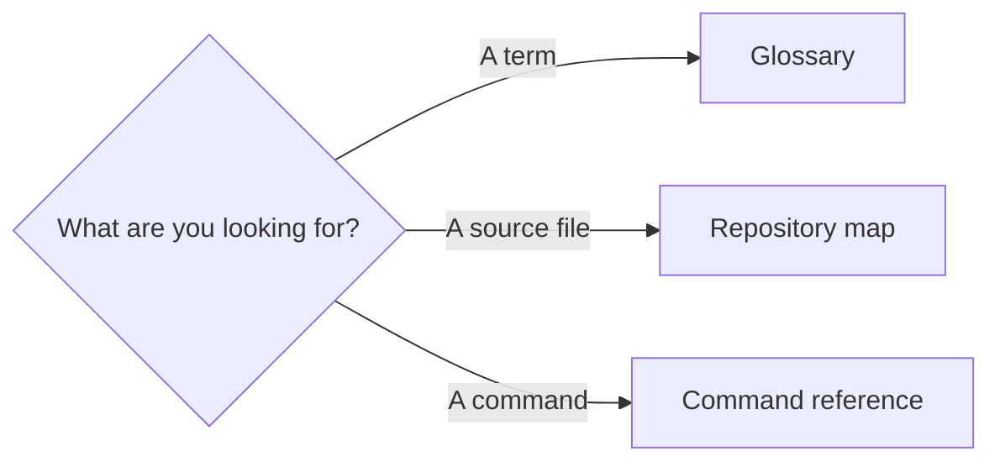

# 99 · Appendix

> **TL;DR** — Quick references for commands, vocabulary, repository navigation, and evidence.

## Contents

- [Glossary](glossary.md) — terms used throughout the book
- [Repository map](repository-map.md) — every important file and responsibility
- [Command reference](command-reference.md) — setup, run, test, and troubleshooting commands

## Source-of-truth hierarchy

1. Current code and tests.
2. Measured runtime evidence.
3. This book.
4. Planned architecture, explicitly labeled planned.
5. Historical PNGTuber V1 assets and manifest.

If documentation conflicts with implemented code, the code is authoritative and the documentation
must be corrected.

---

⬅️ [Roadmap](../08-roadmap/README.md) · 🏠 [Book home](../README.md)
