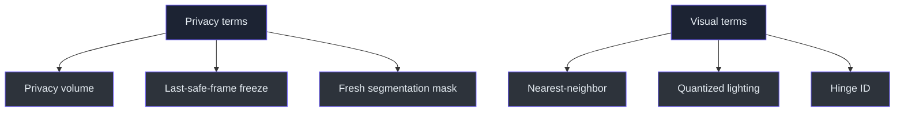

# Glossary

> Terms are defined in the context of KardboardCode-VTuber.

| Term | Definition |
|---|---|
| Backend | OpenCV implementation selected to open a source, such as automatic, DirectShow, Media Foundation, or FFmpeg |
| BGR | OpenCV's default blue-green-red channel ordering |
| Capture worker | Background thread that owns `VideoCapture` and publishes frames |
| Condition variable | Lock plus waiting/notification mechanism used for shared state |
| Consecutive failure | Uninterrupted sequence of failed reads used to trigger reconnect |
| Consumer | Code that reads the latest packet, currently the CLI preview |
| Device index | Integer identifying a local camera, commonly `0` |
| Damped spring | Implemented bounded-step motion model used by the five textured flap hinges |
| Dependency inversion | Depending on a small protocol rather than concrete camera hardware |
| Dithering | Patterned color approximation; the current GPU style instead uses quantized lighting and 5-bit color |
| Dropped frame | Frame intentionally or unintentionally not processed by a consumer |
| End-to-end latency | Time from physical capture to visible output |
| FFmpeg | OpenCV backend useful for network video decoding |
| Finite-state machine | Explicit set of lifecycle states and allowed transitions |
| Frame age | Current post-decode time since the worker published a packet |
| FramePacket | Sequence, monotonic timestamp, and BGR frame |
| FPS | Frames per second |
| Frozen dataclass | Python data object whose fields cannot be reassigned |
| GIL | Python Global Interpreter Lock; native OpenCV work can execute outside normal Python bytecode |
| Head pose | Tracked head translation and orientation |
| IP Webcam | Android application hosting the phone camera as a network stream |
| JPEG | Compressed image format used by MJPEG |
| Latest-frame slot | Single replaceable packet used instead of a FIFO queue |
| MediaPipe | Implemented face-landmark, blendshape, and transformation-matrix inference engine |
| Mirroring | Horizontal flip that produces selfie-style interaction |
| MJPEG | Stream of JPEG images delivered as multipart HTTP |
| Monotonic clock | Clock guaranteed not to move backward, used for durations |
| ModernGL | Python OpenGL wrapper used by the default offscreen textured renderer |
| Negotiated format | Width, height, and FPS reported after opening a source |
| Nearest-neighbor | Pixel-preserving upscale used by both renderer paths |
| NumPy array | In-memory representation of an OpenCV frame |
| OBS | Streaming/recording application that captures the preview through Window Capture and optional chroma key |
| One Euro filter | Implemented adaptive low-pass filter for tracking jitter reduction |
| OpenCV | Current video capture, transform, diagnostics, and preview library |
| Overwritten frame | Packet replaced before a consumer read it |
| Producer | Capture thread that publishes packets |
| Protocol | Structural interface describing required capture methods |
| PS1 style | Deliberately low-poly, low-resolution, quantized visual language |
| Quaternion | Rotation representation emitted by tracking math; the current renderer consumes derived Euler pose through a model matrix |
| Green screen | Fail-closed person-mask compositor that replaces non-person pixels with pure green |
| Hinge ID | Per-vertex shader value selecting one of five optional flap rotations |
| Privacy volume | Static opaque internal head-covering geometry behind the decorative shell and moving flaps |
| Reconnect | Release and reopen cycle after sustained failures |
| Requested format | Width, height, or FPS asked of a source but not guaranteed |
| Rotation | 90-degree left/right or 180-degree frame transform |
| Sequence number | Strictly increasing packet identity |
| Snapshot | Immutable point-in-time diagnostic record |
| Source | Local device index or network URL |
| Spout2 | Future same-PC GPU texture-sharing option for OBS |
| Stale frame | Frame whose pose no longer represents the user's current movement |
| USB tethering | Private phone-to-PC IP network over USB |
| VideoCapture | OpenCV object that opens and reads video sources |
| Window Capture | Initial OBS method for ingesting the application preview |

---

⬅️ [Appendix](README.md) · 🏠 [Book home](../README.md)
