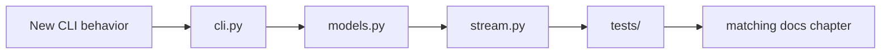

# Repository map

> **TL;DR** — Source is intentionally small. Camera contracts live in `models.py`, runtime behavior
> in `stream.py`, presentation in `cli.py`, and hardware-independent proof in `tests/`.

```text
KardboardCode-VTuber/
├── assets/PNGTuberV1/       Preserved original avatar and behavior manifest
├── docs/                    This engineering book
├── models/                  Downloaded ML models at runtime; ignored except .gitkeep
├── src/kardboard_vtuber/
│   ├── camera/models.py     Typed contracts, enums, validation, redaction
│   ├── camera/stream.py     Thread, latest slot, lifecycle, reconnects, metrics
│   ├── cli.py               Arguments, preview, diagnostics, shutdown
│   └── __main__.py          python -m entry
├── tests/                   Deterministic camera unit tests
├── pyproject.toml           Packaging, dependencies, Ruff, pytest
└── README.md                Project landing page
```

## Key-file reference

| File | Responsibility |
|---|---|
| `src/kardboard_vtuber/camera/models.py:15-48` | Backend and rotation translation |
| `src/kardboard_vtuber/camera/models.py:62-87` | Source parsing and credential redaction |
| `src/kardboard_vtuber/camera/models.py:90-121` | Configuration and invariants |
| `src/kardboard_vtuber/camera/models.py:124-157` | Frame and diagnostic contracts |
| `src/kardboard_vtuber/camera/stream.py:39-73` | Worker-owned runtime state |
| `src/kardboard_vtuber/camera/stream.py:78-141` | Public lifecycle/read API |
| `src/kardboard_vtuber/camera/stream.py:167-220` | Capture loop |
| `src/kardboard_vtuber/camera/stream.py:223-288` | Open, configure, reconnect, FPS |
| `src/kardboard_vtuber/cli.py:15-52` | Command-line interface |
| `src/kardboard_vtuber/cli.py:54-126` | Preview loop and cleanup |
| `tests/test_camera_models.py:6-34` | Model tests |
| `tests/test_camera_stream.py:13-98` | Fake adapter and worker tests |
| `assets/PNGTuberV1/model-manifest.json:1` | Original avatar state/layer semantics |

## Change-impact guide



---

⬅️ [Appendix](README.md) · ➡️ [Command reference](command-reference.md)
