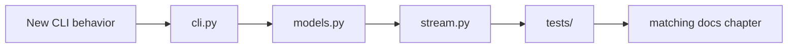
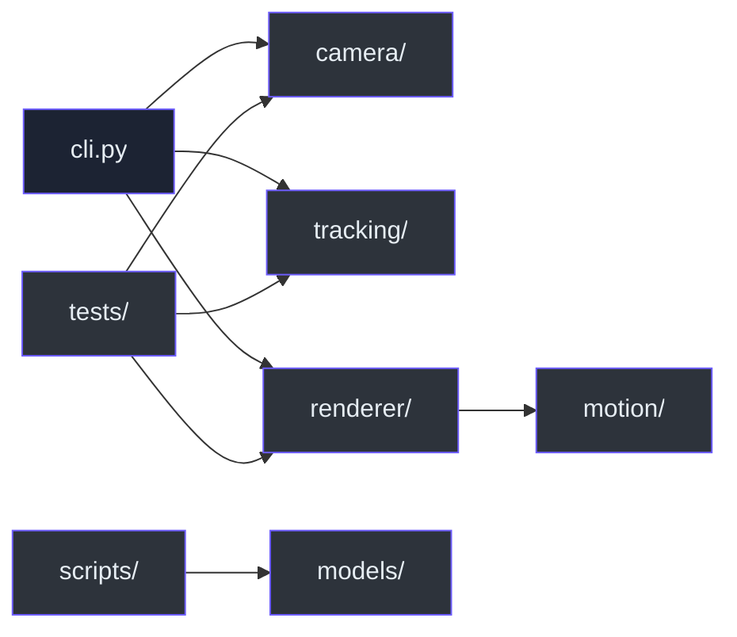

# Repository map

> **TL;DR** — Camera, tracking, motion, rendering, composition, and presentation are separated into
> focused packages, with deterministic proof in `tests/` and verified model downloaders in
> `scripts/`.

```text
KardboardCode-VTuber/
├── assets/PNGTuberV1/       Preserved original avatar and behavior manifest
├── docs/                    This engineering book
│   └── images/              Face-free synthetic documentation renders
├── models/                  Downloaded ML models at runtime; ignored except .gitkeep
├── scripts/                 Verified model downloaders and regression tooling
├── src/kardboard_vtuber/
│   ├── camera/models.py     Typed contracts, enums, validation, redaction
│   ├── camera/stream.py     Thread, latest slot, lifecycle, reconnects, metrics
│   ├── tracking/            Face, pose, hand, person-mask, filtering, events
│   ├── motion/springs.py    Bounded damped-spring primitive
│   ├── renderer/            Textured GPU, procedural fallback, and body renderers
│   ├── cli.py               Arguments, orchestration, composition, preview, shutdown
│   └── __main__.py          python -m entry
├── tests/                   Deterministic unit and offscreen render tests
├── pyproject.toml           Packaging, dependencies, Ruff, pytest
└── README.md                Project landing page
```

## Key-file reference

| File | Responsibility |
|---|---|
| `src/kardboard_vtuber/camera/models.py:15-48` | Backend and rotation translation |
| `src/kardboard_vtuber/camera/models.py:62-87` | Source parsing and credential redaction |
| `src/kardboard_vtuber/camera/models.py:90-121` | Configuration and invariants |
| `src/kardboard_vtuber/camera/models.py:124-157` | Frame and diagnostic contracts |
| `src/kardboard_vtuber/camera/stream.py:39-73` | Worker-owned runtime state |
| `src/kardboard_vtuber/camera/stream.py:78-141` | Public lifecycle/read API |
| `src/kardboard_vtuber/camera/stream.py:167-220` | Capture loop |
| `src/kardboard_vtuber/camera/stream.py:223-288` | Open, configure, reconnect, FPS |
| `src/kardboard_vtuber/tracking/models.py:15-151` | Library-neutral face state |
| `src/kardboard_vtuber/tracking/green_screen.py:16-152` | Async segmentation and fail-closed chroma composition |
| `src/kardboard_vtuber/motion/springs.py:26-85` | Bounded damped spring |
| `src/kardboard_vtuber/renderer/textured_3d.py:111-1414` | Default mesh, shader, atlas, decals, privacy, and hinges |
| `src/kardboard_vtuber/renderer/ps1_cardboard.py:35-370` | Procedural privacy-safe fallback |
| `src/kardboard_vtuber/cli.py:32-213` | Command-line interface |
| `src/kardboard_vtuber/cli.py:215-414` | Runtime orchestration and cleanup |
| `scripts/generate_documentation_gallery.py:1` | Face-free angle, scenario, physics, surface, tracking, skeleton, and mesh-debug galleries |
| `scripts/generate_readme_animation.py:1` | Face-free animated GIF driven by private numeric tracking telemetry |
| `tests/test_camera_models.py:6-34` | Model tests |
| `tests/test_camera_stream.py:13-98` | Fake adapter and worker tests |
| `tests/test_textured_3d_renderer.py:1-409` | GPU geometry, decals, privacy, depth, and physics |
| `tests/test_green_screen.py:1-47` | Segmentation composition and stale-mask behavior |
| `assets/PNGTuberV1/model-manifest.json:1` | Original avatar state/layer semantics |

## Change-impact guide





---

⬅️ [Appendix](README.md) · ➡️ [Command reference](command-reference.md)
