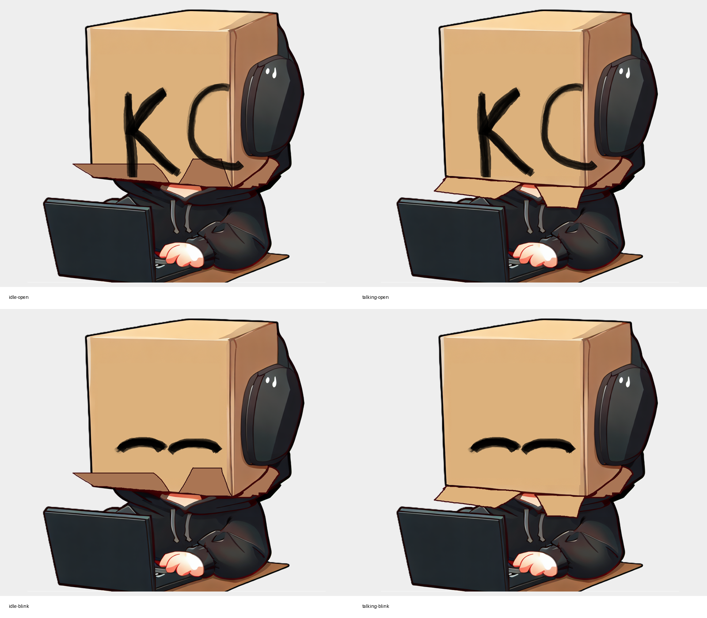
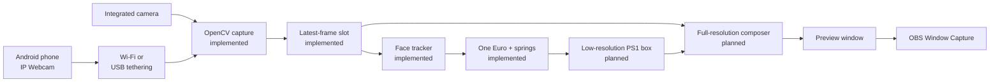

# KardboardCode VTuber Engineering Book

> **TL;DR** — This is the engineering book for a lightweight Python VTuber that keeps the real
> camera image, tracks one face, and overlays a deliberately low-resolution PS1-style cardboard
> head. The camera chapter is implemented and verified. Tracking and rendering chapters describe
> the next planned systems and clearly label them as planned.

This documentation is written to be read in sequence, used as an interview study guide, and reused
as the technical backbone for a future development video. It explains not only **what** the code
does, but also **why** each data structure, algorithm, boundary, and tradeoff exists.

  

<em>
The preserved PNGTuber V1 model: idle/talking and open/blinking states form two independent axes.
The new application carries this visual identity into a camera-tracked PS1-style cardboard head.
</em>

## Book status

| Part | Status | Evidence |
|---|---|---|
| Camera ingestion | Implemented and verified | `src/kardboard_vtuber/camera/`, covered by the 37-test suite |
| Android IP Webcam integration | Implemented and user-verified | 1080x1920 preview at about 28-30 FPS |
| Face tracking | Implemented and live-validated | MediaPipe near 30 result FPS plus debounced action logs |
| PS1 renderer | Basic prototype implemented | Procedural pixel box, K/C eyes, mouth flaps, recorded-video validation |
| OBS integration | Planned | Initial Window Capture path selected |

## Reading paths

| I want to… | Read this path |
|---|---|
| Understand the project in ten minutes | [Foundations](01-foundations/README.md) → [System architecture](02-architecture/system-architecture.md) |
| Run the working camera tool | [Camera ingestion](05-camera-ingestion/README.md) → [Android IP Webcam](05-camera-ingestion/android-ip-webcam.md) |
| Explain the design in an interview | [Principal engineer guide](00-onboarding/principal-engineer-guide.md) → [Algorithms](03-algorithms-and-data-structures/README.md) → [Design principles](04-design-principles/README.md) |
| Learn every data structure | [Domain and runtime data model](02-architecture/data-model.md) |
| Study every current algorithm | [Algorithms and data structures](03-algorithms-and-data-structures/README.md) |
| Understand tracking | [Face tracking](06-face-tracking/README.md) |
| Understand testing | [Quality and testing](07-quality-and-testing/README.md) |
| Understand what comes next | [Roadmap](08-roadmap/README.md) |
| Look up a term or file | [Glossary](99-appendix/glossary.md) → [Repository map](99-appendix/repository-map.md) |

## Chapters

| # | Chapter | Question answered |
|---:|---|---|
| 00 | [Onboarding](00-onboarding/README.md) | How should a newcomer or principal engineer approach this system? |
| 01 | [Foundations](01-foundations/README.md) | What are we building, what does the avatar look like, and under which constraints? |
| 02 | [Architecture](02-architecture/README.md) | How do capture, tracking, rendering, and OBS fit together? |
| 03 | [Algorithms and data structures](03-algorithms-and-data-structures/README.md) | Which algorithms preserve low latency and correctness? |
| 04 | [Design principles](04-design-principles/README.md) | Which engineering principles shaped the implementation? |
| 05 | [Camera ingestion](05-camera-ingestion/README.md) | How does the implemented subsystem work and how is it operated? |
| 06 | [Face tracking](06-face-tracking/README.md) | How are landmarks, expressions, and head pose produced? |
| 07 | [Quality and testing](07-quality-and-testing/README.md) | How do we verify behavior without depending only on hardware? |
| 08 | [Roadmap](08-roadmap/README.md) | How will filtering, PS1 rendering, and OBS output be added? |
| 99 | [Appendix](99-appendix/README.md) | Where are commands, terms, source files, and quick references? |

## The system in one picture

## Documentation contract

Every chapter follows these rules:

1. Start with a TL;DR and state whether behavior is implemented or planned.
2. Explain the concept at beginner level before introducing implementation detail.
3. Ground implementation claims in real repository files and line numbers.
4. Use diagrams where structure, state, flow, or tradeoffs are easier to see than to describe.
5. Separate measured facts from targets and future design.
6. Never store camera credentials, stream passwords, or private authenticated URLs.

---

Start with [00 · Onboarding](00-onboarding/README.md) · Look up terms in the
[Glossary](99-appendix/glossary.md)
