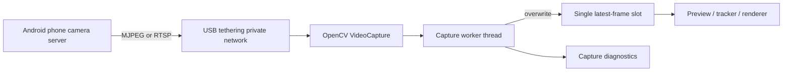

# Camera Capture Pipeline

## Purpose

The camera subsystem is the first executable part of KardboardCode-VTuber. It accepts either:

- A local Windows camera index such as `0`.
- An HTTP MJPEG, RTSP, or other OpenCV-supported stream URL.

The selected Android design uses a phone-only camera-server application over USB tethering. No vendor camera application or virtual-camera driver is installed on Windows. The Python tool reads the URL directly.

## Architecture



## Design principles

### Latency over completeness

Video frames are perishable. Processing every frame in order creates increasing delay whenever the consumer is slower than the source. `LatestFrameCamera` therefore stores exactly one frame. A newer frame overwrites an unread older frame.

This is intentional:

```text
normal queue: frame 101 -> 102 -> 103 -> 104 -> delayed output
latest slot:                       104 -> current output
```

The `overwritten_frames` counter measures this behavior. Overwrites are healthy when downstream tracking runs more slowly than capture.

### Monotonic timestamps

`FramePacket.captured_at_ns` uses `time.monotonic_ns()`. Wall-clock corrections cannot make this timestamp move backwards, so frame age and latency calculations remain valid.

### Explicit lifecycle

The worker has five states:

| State | Meaning |
|---|---|
| `STOPPED` | No worker is active. |
| `STARTING` | Initial source open is in progress. |
| `RUNNING` | Frames are being received. |
| `RECONNECTING` | The stream failed and will be reopened. |
| `FAILED` | An unexpected worker exception terminated capture. |

### Requested versus negotiated format

Width, height, FPS, and buffer size are requests sent through OpenCV. Drivers and network streams may ignore them. The actual values returned by OpenCV are recorded in `CaptureSnapshot`.

Never claim the camera is running at 1080p60 merely because those values were requested.

### Dependency inversion

`LatestFrameCamera` accepts a `capture_factory`. Production uses `cv2.VideoCapture`; tests inject `FakeCapture`. This keeps camera timing logic testable without hardware.

## Data structures

### `CameraSource`

| Field | Type | Meaning |
|---|---|---|
| `value` | `int | str` | Device index or stream URL. |

Important behavior:

- Numeric CLI values become integer device indices.
- Values containing `://` are recognized as network streams.
- Credentials in diagnostic URLs are redacted.

### `CameraConfig`

| Field | Type | Invariant |
|---|---|---|
| `source` | `CameraSource` | Must be non-empty. |
| `backend` | `CameraBackend` | `auto`, `dshow`, `msmf`, or `ffmpeg`. |
| `requested_width` | `int | None` | Positive when supplied. |
| `requested_height` | `int | None` | Positive when supplied. |
| `requested_fps` | `float | None` | Positive when supplied. |
| `rotation` | `CameraRotation` | `none`, `left`, `right`, or `180`. |
| `mirror` | `bool` | Flips the final captured frame horizontally. |
| `buffer_size` | `int` | At least one; backend support varies. |
| `max_consecutive_failures` | `int` | Number of failed reads before reopening. |
| `reconnect_delay_seconds` | `float` | Non-negative delay between open attempts. |

### `FramePacket`

| Field | Type | Meaning |
|---|---|---|
| `sequence` | `int` | Strictly increasing process-local frame number. |
| `captured_at_ns` | `int` | Monotonic time immediately after successful read. |
| `frame` | `numpy.ndarray` | OpenCV BGR image with shape `(height, width, 3)`. |

### `CaptureSnapshot`

An immutable point-in-time diagnostic record. It reports state, source, backend, negotiated dimensions/FPS, measured FPS, frame counters, reconnections, and the last error.

## Capture algorithm

1. Open the source with the configured OpenCV backend.
2. Apply buffer, dimension, and FPS requests.
3. Read back negotiated properties.
4. Continuously call `read()` on the capture object.
5. On success:
   - Apply the configured orientation correction.
   - Optionally mirror the frame.
   - Timestamp it.
   - Assign a new sequence number.
   - Overwrite the single shared frame slot.
   - Notify waiting consumers.
6. On temporary failure:
   - Increment the read-failure counter.
   - Retry briefly.
7. After repeated failures:
   - Release the capture object.
   - Enter `RECONNECTING`.
   - Wait and reopen the source.
8. On shutdown:
   - Signal the worker.
   - Join the thread.
   - Release OpenCV resources.

## Thread-safety

The worker and consumer share state under one `threading.Condition`.

- The worker holds the condition while publishing a packet or changing lifecycle state.
- Consumers may wait for `sequence > after_sequence`.
- Frames are copied by default when returned.
- The CLI requests `copy=False` because it consumes the frame immediately and only one thread owns it.

Future tracking code should normally request a copy or guarantee it finishes before the backing frame can be reused.

## Android USB-tethered setup

1. Install a camera-server application only on the Android phone.
2. Connect the Nothing Phone (3a) with a USB data cable.
3. Select `USB tethering`.
4. Start the camera server and note its tether-interface URL.
5. Confirm the URL from a Windows browser.
6. Run:

```powershell
python -m kardboard_vtuber `
  --source "http://PHONE_USB_IP:8080/video" `
  --backend ffmpeg `
  --rotate left
```

If `ffmpeg` fails, retry with `--backend auto`.

## Local-camera fallback

```powershell
python -m kardboard_vtuber --source 0 --backend auto
python -m kardboard_vtuber --source 0 --backend dshow
python -m kardboard_vtuber --source 0 --backend msmf
```

Benchmark both Windows backends. Device and driver behavior determines the better choice.

### Verified development-machine results

The integrated camera was tested headlessly for five seconds on the development machine:

| Backend | Negotiated format | Measured result |
|---|---|---|
| `auto` | 640x480 at 30 FPS | Approximately 30 FPS; recommended local-camera default. |
| `dshow` | 640x480; driver reported 0 FPS | Approximately 12 FPS. |
| `msmf` | 640x480 at 30 FPS | Opened successfully but produced only one frame during the short probe. |

These values describe this machine and camera only. They are not portable performance guarantees.

Development validation also completed successfully with:

```powershell
python -m pytest
python -m ruff check .
python -m kardboard_vtuber --help
```

The current unit suite contains eight passing tests. Android stream validation results are recorded
below.

## Verified IP Webcam Wi-Fi baseline

The Nothing Phone (3a) IP Webcam server was successfully reached over Wi-Fi at its direct
`/video` MJPEG endpoint with HTTP authentication enabled. Credential values are intentionally
not stored in this repository.

The first eight-second headless probes before restarting the phone server produced:

| Backend | Negotiated format | Measured result |
|---|---|---|
| `ffmpeg` | 1920x1080 at 25 FPS | Approximately 3 FPS; no failures or reconnects. |
| `auto` | 1920x1080 at 25 FPS | Approximately 3-5 FPS; no failures or reconnects. |

After the IP Webcam server was restarted, `auto` delivered approximately 30 FPS at the same
1920x1080 negotiated format with no failures or reconnects. The earlier low result was therefore
transient and not a stable transport limit.

The phone's portrait stream requires `--rotate left`, which applies a 90-degree counterclockwise
rotation and produces an upright portrait frame. This orientation was verified from a temporary
captured frame; the image was deleted after inspection.

### User-confirmed preview

The complete interactive preview was subsequently confirmed working with:

- 1080x1920 output after rotation.
- Approximately 27.9 FPS at the observed moment.
- 0.4 ms reported frame age between capture-thread publication and preview consumption.
- Correct upright orientation with `--rotate left`.
- Selfie-style horizontal orientation with `--mirror`.

The displayed frame-age metric measures latency inside this Python process after OpenCV returns a
decoded frame. It does not include phone exposure, JPEG encoding, Wi-Fi transport, or decoder
buffering, so it must not be described as end-to-end camera latency.

## Diagnostics

Every two seconds the CLI prints:

- Lifecycle state.
- Redacted source.
- Backend.
- Negotiated width, height, and FPS.
- Measured received FPS.
- Total frames.
- Overwritten frames.
- Failed reads.
- Reconnection count.

The preview overlay shows frame size, measured FPS, and age of the current frame when displayed.

## Failure modes

### URL opens in browser but not OpenCV

- Try `--backend ffmpeg`.
- Confirm the URL is the direct MJPEG/RTSP endpoint, not the HTML control page.
- Check whether authentication is required.
- Verify the phone app permits the requested resolution.

### High latency

- Use USB tethering rather than Wi-Fi.
- Reduce phone encoder buffering.
- Prefer MJPEG for the first prototype.
- Confirm `overwritten_frames` increases instead of allowing queues.
- Reduce source resolution temporarily to isolate decode cost.

### Repeated reconnects

- Keep the phone screen/application active.
- Disable battery optimization for the phone camera app.
- Confirm USB tethering remains enabled.
- Verify the cable and USB port.

## Security

- Prefer the USB tether interface rather than Wi-Fi.
- Disable phone Wi-Fi while testing if the camera server binds every interface.
- Enable phone-app authentication when supported.
- URLs containing credentials are redacted in diagnostics.
- Never commit camera passwords or private stream URLs.

## Upgrade path

The camera API intentionally does not depend on MediaPipe or rendering. Future components consume `FramePacket`:

```text
LatestFrameCamera
    ├── downscaled copy -> MediaPipe tracking
    └── full frame      -> ModernGL composition
```

Replacing OpenCV display with ModernGL will not require changing capture semantics.
